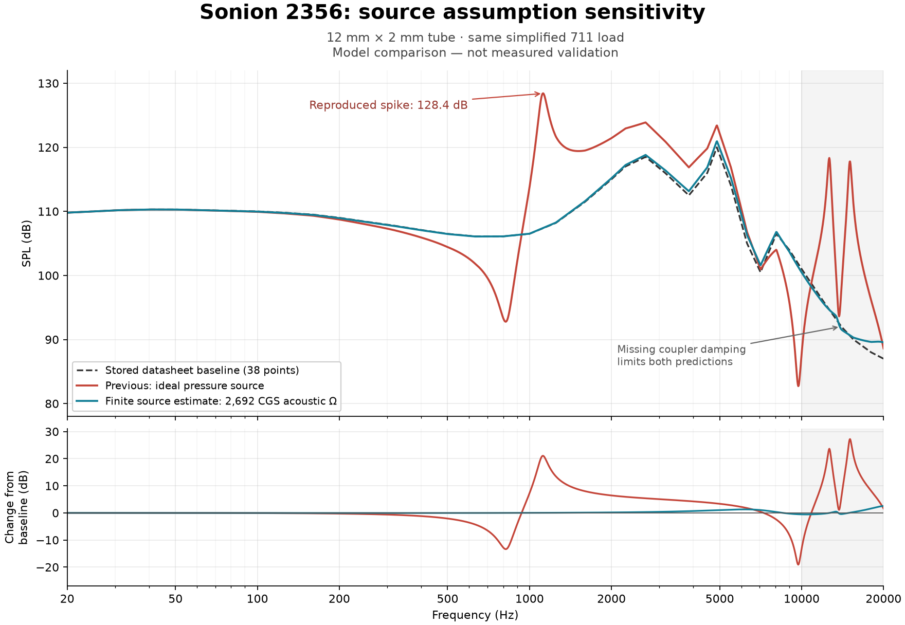

# Sonion 2356 frequency-response investigation

The screenshot is reproducible in the shipped WASM engine. It is a source/load-model problem, not a chart-rendering error. An exact reference match was hiding it because the acoustic model cancels itself.

## Reproduction

The live database's default Sonion 2356 measurement contains 38 digitised magnitude points, no measured phase, and this reference fixture:

- 4.5 mm tube, 1.4 mm inside diameter;
- 11 mm tube, 1.9 mm inside diameter;
- IEC 711 coupler, 0.100 V RMS drive.

With the screenshot's 12 mm × 2 mm tube, zero additional loss, the existing simplified 711 load, 20°C and 50% humidity, the old forced ideal-pressure source produces the same distinctive extrema. The comparison below uses the same engine, baseline and load for both source assumptions. Values are rounded from a 2,001-point logarithmic sweep.

| Frequency | Previous ideal-pressure model | Finite source estimate |
| --- | ---: | ---: |
| 817 Hz | 92.8 dB | 106.1 dB |
| 1.122 kHz | 128.4 dB | 107.4 dB |
| 2.670 kHz | 123.9 dB | 118.8 dB |
| 9.717 kHz | 82.7 dB | 101.3 dB |
| 12.634 kHz | 118.3 dB | 94.6 dB |
| 15.067 kHz | 117.8 dB | 90.6 dB |

These are model results, not measured validation. The smoother estimate is not evidence that it is the real Sonion response.

## Why the reference alone looked correct

The acoustic correction is `H(design, load, source) / H(reference, reference load, source)`. With identical geometry and loads, this equals one for either source assumption, even when the model is physically incomplete. The reference button also replaces the design geometry and output load. A unity pass therefore verifies cancellation, not the ability to predict another tube.

The old request always specified zero acoustic source impedance. Changing tube geometry then moves sharp resonances in the model: division by the reference resonance creates a dip, while the new design resonance creates a peak. The 817 Hz / 1.122 kHz pair is a direct reproduction of this effect. Thermoviscous tube losses already exist when the UI's additional LOSS is zero; zero LOSS does not mean a completely lossless tube.

The coupler also remains incomplete. Its code includes the main cylinder and microphone RLC termination, but omits the two side cavities and lossy slits. Those elements are important to the actual 711 acoustic impedance and damping. The microphone RLC values alone do not describe a full coupler. See the [COMSOL generic 711 model](https://doc.comsol.com/6.4/doc/com.comsol.help.models.aco.generic_711_coupler/generic_711_coupler.html).

## Corrections made

- Referenced measurements now default to an explicitly labelled finite-resistance estimate. It is `rho*c/area` at 20°C / 50% humidity, using a fixed reference bore: about 2.692×10⁸ Pa·s/m³ for this 1.4 mm reference. It is an assumed source resistance, not a fitted or measured Sonion parameter. Editing the design bore or running reverse optimisation does not change the source. Custom resistance and the old ideal-pressure limiting case are available for comparison.
- Catalog damper values now convert from CGS acoustic ohms to the engine's SI units: multiply by 100,000. Reference-path copying, forward simulation, reverse constraints and returned candidates use the conversion consistently. Previously a 1,000-ohm catalog damper reached the solver as 1,000 instead of 100,000,000 Pa·s/m³ and had almost no effect. This is a separate bug; the screenshot has no damper. CGS catalog ratings are documented in [Voss and Allen's measured damper study](https://jontallen.ece.illinois.edu/uploads/537.F18/Papers/Public/VossAllen94.pdf); the conversion appears in [ASTM C522's unit table](https://store.astm.org/c0522-03r16.html).
- The reference action is labelled a unity check. The UI identifies the simplified coupler and source assumptions, and identifies comparisons that also change the output load. Changing load/environment clears a previous reference-check state.
- The resonance card is labelled a geometric quarter-wave estimate, with serial path lengths summed. Transit time also uses the entire path. These are not the actual response peak or group delay.

Saved catalog damper numbers remain unchanged; conversion occurs at the WASM boundary. Old referenced projects without source settings receive the finite estimate. Explicitly selected source settings persist in saved projects. No response smoothing or clipping was introduced.

## Remaining accuracy limits

A magnitude-only response under one fixture does not determine the receiver's complex acoustic source impedance. Reliable absolute predictions for different bores, chambers and loads need a measured/manufacturer receiver model (or calibration against several known loads) and a validated coupler model. The simplified coupler has not been replaced by a full IEC model in this change. Missing manufacturer phase also limits multi-driver summation. Reverse-design scores are conditional on these assumptions, not measurements of the finished IEM.

## Verification

Run `node --disable-warning=ExperimentalWarning --test tests/*.test.mjs` from the repository root: **58 tests pass**, including eight acoustic regressions using the shipped WASM binary. They reproduce the screenshot, check source invariance, verify a damper against an independent pressure-divider calculation, exercise reference copying and reverse-search unit conversion, preserve forward/optimizer agreement, reject invalid source resistance, and check that splitting a uniform tube preserves its response and path metrics.

Local browser checks verified the 12 mm response, switching between estimated/custom source resistance, resetting the estimate after a custom value, reference unity, and clearing the reference pass after changing the output load. Production authentication was unchanged; the preview used a local fixture. Changes have not been deployed.

## Follow-up: coverage of every database driver

A follow-up audit checked all **10 current default driver measurements**, rather than assuming the Sonion 2356 fixture represented the whole library. The shared damper conversion applies to every path, but the original finite-source change did not make every database entry usable.

| Driver | Current acoustic-prediction status |
| --- | --- |
| Sonion 2356 | Approximate model tested with reference geometry, three changed tube geometries and dampers |
| Sonion 17A003 | Same checks passed |
| Sonion 28UAP01 | Added 2 cc reference-load approximation; same checks passed |
| Sonion 33AJ007i/9 | Same checks passed |
| Sonion 38D1XJ007Mi/8a | Same checks passed |
| Sonion EST65DA01 | Same checks passed |
| Knowles CI-22955-000 | Unavailable: DB2012 adapter dimensions are missing |
| Knowles HODVTEC-31618-000 | Unavailable: only a coupler record; no reference tube/adapter dimensions |
| Knowles RDI-34006-000 | Unavailable: “711 Hi-Res” fixture has no stated tube geometry |
| Knowles RAU-34832-B148 | Unavailable: “711 Hi-Res” fixture has no stated tube geometry |

The 2 cc reference now maps to a 2,000 mm³ closed-cavity approximation. This is a volume-only model, not a calibrated complete coupler; manufacturers distinguish the [2 cm³ coupler](https://www.grasacoustics.com/products/ear-simulator/without-microphone-cartridges/product/252-RA0038) from the 711 ear simulator. Old saved projects recover this newly supported reference load. Reference matching also resets stale cavity leakage resistance, as well as cavity volume.

“711 Hi-Res” is recognised as a 711-family label, but a recognised coupler does not establish the missing adapter geometry. Incomplete references no longer claim compensation or offer a unity check. Forward and reverse simulations report the missing fixture data instead of treating an unknown reference path as an empty one and producing misleading curves. No missing manufacturer dimensions were invented.

The new `tests/driver-library-acoustics.test.mjs` exercises the actual default library snapshot offline. It checks all six supported references, fixed source resistance across geometry changes, effective damper conversion, migration of old 2 cc projects, and forward/reverse rejection of all four incomplete references. The complete suite now contains **69 passing tests**. Six approximate models being operational is not validation against physical measurements; the four Knowles entries still need verified measurement-fixture geometry before acoustic prediction is available.
