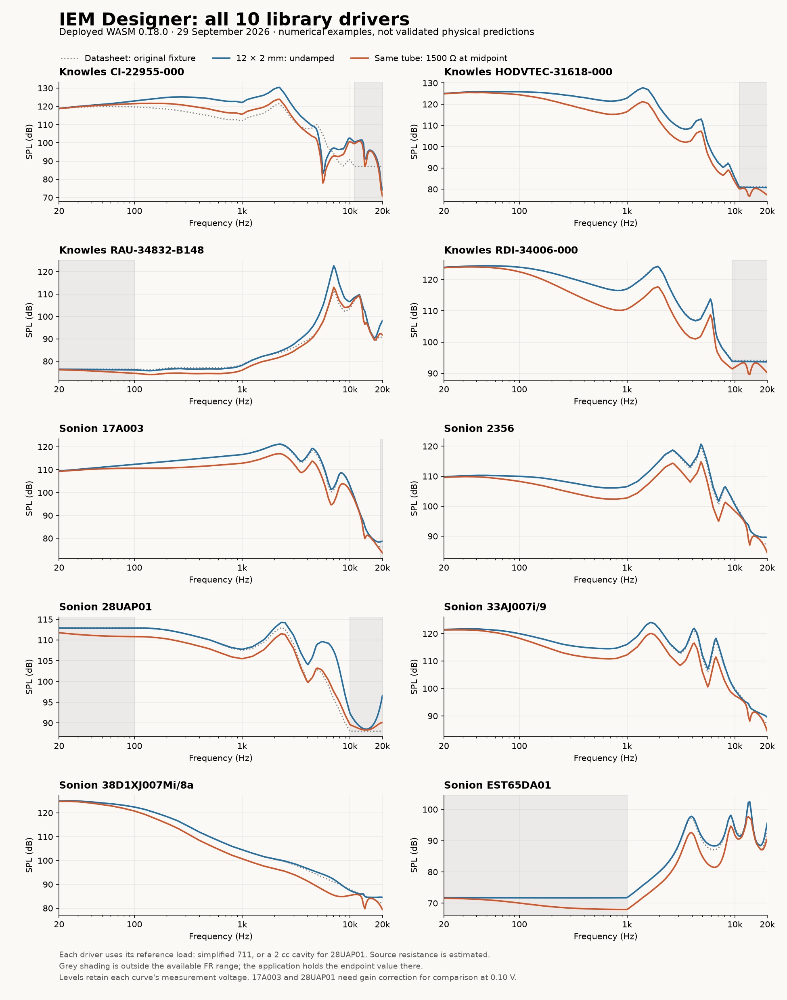

# IEM Designer system test report

**Test date: 29 September 2026. Verdict: the software operates for all ten current library drivers, but it is not yet a validated acoustic design simulator.**

Follow-up: the common-voltage defect described below has since been fixed locally, with a passing regression check. See the [validation protocol and current results](IEM_VALIDATION_PROTOCOL.md). This report retains the original audit findings; the physical damping discrepancy remains unresolved.

The calculations, circuit controls, polarity, undamped comparisons, project persistence and bounded reverse search passed the checks described below. The known Sonion damping mismatch remains. This audit also reproduced a separate common-voltage calibration failure: measurement drive voltage is discarded before simulation, so absolute levels from different measurement voltages are combined without correction.

This was an audit of the current system. The additions are reproducible diagnostics, captured inputs, plots and this report; no production calculation code, driver records or deployment was changed.

## 1. Scope and evidence

| Item | Tested state |
| --- | --- |
| Repository | `5c9ba07e3d3fedbd7356bfdf9c1461632d23aeb5`; clean before this audit |
| Page / engine | IEM Designer 0.25; Hammer Craft Acoustic Engine 0.18.0 |
| Live library | Read on 29 September: **10 drivers, 16 measurement sets, 703 FR rows, 240 impedance rows, 30 reference-path rows** |
| Selected data | All ten default responses match the earlier regression fixtures. Alternate impedance sets were considered using the application's fallback rule. |
| Production assets | Six key assets returned HTTP 200. HTML, designer JS, circuit JS, WASM loader and JS glue match the checkout byte-for-byte. The production WASM differs in bytes, so it was downloaded and tested separately. |
| Existing regression suite | **89/89 pass locally; 89/89 pass using the downloaded production WASM.** This is the full repository suite, including non-IEM tests; these are not 89 tests per driver. |
| Expanded numerical audit | **17/17 check groups for each driver, on each binary: 170/170 per binary.** A further mixed-driver pressure-sum check also passes. |
| Stability sweeps | **475 cases per driver; 4,750 cases per binary**, with 240 frequencies per case from 20 Hz to 20 kHz. This is 1,140,000 sweep frequency evaluations per binary. |
| Additional calibration check | **FAIL:** changing only a baseline's measurement voltage from 0.10 to 0.20 V produces an identical simulation request and 0 dB output change. A common-voltage conversion would require −6.02 dB. |
| Browser workflows | **10/10 drivers pass** in an isolated localhost preview using the deployed WASM and current assets. No browser errors or warnings were recorded. |
| Native Rust | `cargo test --locked` compiles successfully, but discovers **zero native unit/doc tests**. The meaningful acoustic tests above execute WASM. One existing unused-function warning remains. |
| Authentication | The production designer correctly redirects this unauthenticated browser to login. Authenticated admin startup, role authorization and product-target loading against an admin account were **not verified in production**. |

The two binaries have different SHA-256 hashes:

- Local: `fa4bc0244f3f1a040232740f2dac5e4f4cc32ae56e5ab9dc309d54a84e52e225`
- Deployed: `6821ed4758d1bb9175ee42f8117e5b6bd6abd2f020b7d1d9975382f95c782bde`

Both report engine 0.18.0 and give identical standard plotted curves. Their saved numerical metrics differ by at most approximately `6.1 × 10⁻¹⁶`, consistent with floating-point arithmetic. A byte difference alone is therefore not evidence of an acoustic regression. This establishes agreement for the tested cases, not every possible input.

## 2. Results for every driver

“Functional” includes the 17 groups listed in section 3. “475/475” means all sweep outputs remained finite and the source model stayed fixed as geometry changed. Neither result certifies measured acoustic accuracy.

| Driver | Functional, both binaries | Sweep cases per binary | Browser | Physical measurement validation |
| --- | --- | --- | --- | --- |
| Knowles CI-22955-000 | 17/17 PASS | 475/475 PASS | PASS | Not established; adapter assumed |
| Knowles HODVTEC-31618-000 | 17/17 PASS | 475/475 PASS | PASS | Not established; direct coupling assumed |
| Knowles RAU-34832-B148 | 17/17 PASS | 475/475 PASS | PASS | Not established; Hi-Res load approximated |
| Knowles RDI-34006-000 | 17/17 PASS | 475/475 PASS | PASS | Not established; tool geometry unavailable |
| Sonion 17A003 | 17/17 PASS | 475/475 PASS | PASS | Not established; voltage correction also missing |
| Sonion 2356 | 17/17 PASS | 475/475 PASS | PASS | **Published damped example does not match** |
| Sonion 28UAP01 | 17/17 PASS | 475/475 PASS | PASS | Not established; 2 cc approximation and missing voltage correction |
| Sonion 33AJ007i/9 | 17/17 PASS | 475/475 PASS | PASS | Not established |
| Sonion 38D1XJ007Mi/8a | 17/17 PASS | 475/475 PASS | PASS | Not established; internal damper response not separately identified |
| Sonion EST65DA01 | 17/17 PASS | 475/475 PASS | PASS | Not established; source/transformer behaviour not separately identified |

### Data quality by driver

The ranges below describe the **available library data**, not a validated operating range of the physical driver. All ten selected FR curves and all ten selected impedance curves lack measured phase. Their magnitudes are digitized or sparse published values.

| Driver | FR points / available span | Z points / available span | Baseline voltage | Gain to compare at 0.10 V |
| --- | --- | --- | ---: | ---: |
| CI-22955-000 | 56 / 20–11,000 Hz | 58 / 20–20,000 Hz | 0.10 V | 0 dB |
| HODVTEC-31618-000 | 56 / 20–11,000 Hz | 58 / 20–20,000 Hz | 0.10 V | 0 dB |
| RAU-34832-B148 | 56 / 100–40,855 Hz | 56 / 100–40,555 Hz | 0.10 V | 0 dB |
| RDI-34006-000 | 56 / 19.4–9,433 Hz | 56 / 19.1–21,172 Hz | 0.10 V | 0 dB |
| 17A003 | 129 / 20–19,000 Hz | **2 / 500–1,000 Hz** | **0.07 V** | **+3.10 dB** |
| 2356 | 38 / 20–20,000 Hz | **2 / 500–1,000 Hz** | 0.10 V | 0 dB |
| 28UAP01 | 27 / 100–10,000 Hz | **2 / 500–1,000 Hz** | **0.16 V** | **−4.08 dB** |
| 33AJ007i/9 | 41 / 20–20,000 Hz | **2 / 500–1,000 Hz** | 0.10 V | 0 dB |
| 38D1XJ007Mi/8a | 31 / 20–20,000 Hz | **2 / 500–1,000 Hz** | 0.10 V | 0 dB |
| EST65DA01 | 84 / 1,000–50,000 Hz | **2 / 1,000–5,000 Hz** | 0.10 V | 0 dB |

The corrections follow `20 log10(0.10 / measurement voltage)` and assume small-signal linear behaviour. They correct only the voltage reference; they do not fix differing couplers, unknown phase or the acoustic source model. These corrections are **not currently applied automatically**.

### Fixture details and individual limitations

| Driver | Reference represented in the application | Consequence |
| --- | --- | --- |
| CI-22955-000 | Estimated DB2012 adapter: 8.6 × 13.2 mm + 5 × 7.6 mm cylindrical sections; simplified 711 | Cone shape and insertion depth are unknown. A reference unity pass cancels this assumed adapter, without proving it matches the real fixture. |
| HODVTEC-31618-000 | Assumed direct coupling into simplified 711 | Adapter geometry is absent. Changed-tube predictions depend on that assumption. |
| RAU-34832-B148 | Documented 1.75 × 1 mm tube; RA0402/Hi-Res represented by simplified 711 | Tube geometry is documented, but the load is not calibrated to that Hi-Res coupler. |
| RDI-34006-000 | Documented tubeless measurement with tool T8688; direct-coupling approximation | Internal tool geometry is unavailable. The application holds the FR endpoint beyond about 9.43 kHz. |
| 17A003 | 4.5 × 1.4 + 11 × 1.9 mm tubes into simplified 711 | Dense FR does not supply acoustic source impedance. Electrical crossover results remain limited by two Z samples and absent phase. Baseline voltage differs. |
| 2356 | 4.5 × 1.4 + 11 × 1.9 mm tubes into simplified 711 | Same data limits, plus an independently documented failure against the damped design example. |
| 28UAP01 | 10 × 1 mm tube into 2,000 mm³ closed cavity | Volume-only coupler approximation; database configuration is parallel. Endpoint values are held outside 100 Hz–10 kHz. Baseline voltage differs. |
| 33AJ007i/9 | 4.5 × 1.4 + 11 × 1.9 mm tubes into simplified 711 | Two Z points cannot characterize full-band crossover loading; no known-fixture damped validation is available. |
| 38D1XJ007Mi/8a | 4.5 × 1.4 + 11 × 1.9 mm tubes into simplified 711 | The database notes an integrated Acupass damper. “Undamped, same geometry” removes external design dampers only; it does not remove physical damping already embedded in the baseline. |
| EST65DA01 | 3 × 1.4 + 11 × 1.9 mm tubes into simplified 711 | No FR below 1 kHz and only two Z points. The database describes a transformer-equipped supertweeter; there is no separate identified transformer/transducer model. |

Tube dimensions are length × inner diameter. The detailed source notes and all sixteen measurement-set records are in the [library inventory](reports/2026-09-29-iem-system-audit/library-inventory.json).

## 3. Exactly what was tested

Each of the following ran for **each of the ten drivers**, separately against the local and deployed WASM:

1. Finite, ordered input data and a usable reference profile.
2. Reference/reference unity and reproduction of every original FR landmark.
3. Tube lengths **3, 6, 12, 20, 30 mm**, diameters **0.8, 1, 1.5, 2, 3 mm**, and dampers **0, 320, 680, 1000, 1500, 2200, 4700 CGS acoustic Ω**. Positive dampers were placed at the inlet, midpoint and outlet. There is one undamped case per geometry, giving `25 × (1 + 6 × 3) = 475` cases per driver.
4. A zero-resistance damper and splitting a uniform tube do not change the response.
5. Finite responses for all five output loads and all four acoustic source options. This check tests each option, not every possible source/load cross-product.
6. Chamber and nozzle response calculations remain finite.
7. Series resistors (1, 10, 100 Ω), capacitors (0.1, 1 µF) and an inductor (0.1 mH) match an independently calculated voltage divider using the current real-valued impedance data.
8. Adding 6 dB gain changes SPL by exactly 6 dB within numerical tolerance.
9. Inverting polarity changes phase by 180° while retaining single-driver SPL.
10. Identical drivers add 6.0206 dB; opposite polarity produces numerical cancellation. This synthetic cancellation is not evidence of real-world cancellation depth.
11. Browser-side baseline composition, the combined curve and the undamped comparison agree with direct WASM calculation. Comparison traces do not enter the combined sum.
12. Relative display retains the damped/undamped difference by sharing the normalization offset.
13. Save/New/Load preserves the numerical request, polarity and comparison visibility.
14. Reverse design recovers a known constrained design containing a 12 × 2 mm tube, 680 acoustic-Ω damper, 10 Ω series resistor and 1 µF series capacitor. Applying its result reproduces the target.
15. A separate bounded search returns valid candidates whose scores can be reproduced independently after applying them. This checks candidate scoring and application, not a globally optimal solution.
16. Invalid tube dimensions and a disconnected circuit stop calculation visibly.
17. An unavailable WASM engine cannot silently substitute the approximate JavaScript fallback for damper calculations.

The independent ten-driver sum used different tube lengths, bores, gains and alternating polarities. Its maximum discrepancy from the frontend combined response was below `10⁻¹² dB`. Reference-unity errors were zero; divider and frontend-composition errors were also below `10⁻¹² dB`. These are **arithmetic consistency tolerances**, not claimed measurement precision.

Browser testing loaded every driver with a 12 mm total, 2 mm-ID tube and a 1500 acoustic-Ω damper halfway along it. For each driver it calculated the response, checked engine status and chart creation, changed polarity and comparison visibility, saved, changed those settings again, loaded, verified restoration, and recalculated in relative mode. The 28UAP01 used its 2 cc reference load; the other nine used simplified 711.

A [representative browser screenshot](reports/2026-09-29-iem-system-audit/browser-2356.png) records the completed 2356 calculation. This screenshot demonstrates rendering; the numerical comparisons are recorded separately in the JSON results.

## 4. Unresolved findings

### High priority: absolute levels omit the measurement voltage

`loadDatabaseLibrary()` reads `drive_voltage_v` but does not carry it into the row used by `databaseDriverToDesign()`. The designer also has no common input-voltage setting. Consequently, FR baselines measured at different drive levels can be summed as if directly comparable.

The controlled test changed only a baseline's recorded voltage from 0.10 to 0.20 V. The generated requests were identical and output changed by **0 dB**, rather than the **−6.02 dB** needed to compare those otherwise identical SPL values at a common drive voltage. In the current live library, 17A003 and 28UAP01 are the immediate exceptions to the common 0.10 V reference.

**Required correction:** retain baseline drive voltage and expose a common source voltage, then apply the level conversion consistently in forward calculation, reverse scoring, graph baselines and saved projects. Existing manually corrected gains must not be corrected twice. Until implemented, the table above supplies the isolated voltage correction; it does not calibrate the full acoustic prediction.

### High priority: damped acoustic response is still not validated

The [published Sonion 2356 example](https://datasheet.datasheetarchive.com/originals/crawler/america.sonion.com/64f5a330a4357be5bd691f46e9beae16.pdf) was rerun against the deployed WASM with **7 × 1.5 + 2.5 × 2.1 + 3 × 2.5 mm** tubing and a **1500 acoustic-Ω** damper. Its exact placement is unspecified, so four placements were compared.

| Diagnostic, 100 Hz–8 kHz | Result |
| --- | ---: |
| Undamped response RMS discrepancy | About 0.75 dB |
| Damped response RMS discrepancy | 2.54–2.67 dB, depending on assumed placement |
| Error in damped-minus-undamped change | 2.63–2.76 dB RMS |
| Guide reduction near 2.57 kHz | About 6.8 dB; model predicts 3.9–4.2 dB |
| Guide reduction near 4.89 kHz | About 12.2 dB; model predicts 4.1–5.5 dB |

The guide curves are approximate digitizations, with unknown exact placement/drive conditions. They are still sufficient to demonstrate that the tested model fails to reproduce the pattern of peak reduction. This does not identify one unique replacement model or provide an exact Q measurement.

**Required correction:** identify receiver source impedance/modes and a fuller, characterized coupler model together, using multiple known loads or damper values. The current constant-resistance source cannot infer how every receiver resonance changes with loading. The one-mode RLC option is uncalibrated. The simplified 711 omits side cavities and their losses. Unit-correct resistance and a smooth graph do not resolve these missing physical parameters.

See the [detailed 2356 benchmark](SONION_2356_DAMPING_BENCHMARK.md) and [this audit's fresh benchmark output](reports/2026-09-29-iem-system-audit/sonion-2356-benchmark.json).

### Material limitations affecting all or several drivers

- **No measured phase for any library driver.** The sum is mathematically correct for the supplied/modelled phases, but real multi-driver interference and polarity effects are not validated.
- **Sparse electrical impedance.** All six Sonion entries have only two impedance samples. R/C/L arithmetic passes, but that does not establish physical crossover accuracy across the audio band.
- **Unsupported frequency regions are extended using endpoint values.** For example, EST65DA01 has no baseline FR below 1 kHz, and RDI's curve stops near 9.43 kHz. Full-band graphs do not create measurements in those regions.
- **Fixture assumptions remain.** CI's adapter and HODVTEC's direct coupling are assumed; documented tube dimensions elsewhere do not validate the simplified coupler.
- **Reverse design inherits these errors.** It optimizes the current model and its score, not the true manufactured IEM. The search changes a limited set of physical/electrical parameters; it is not a general network-design solver.
- **Shared acoustic networks are not modelled.** Independent serial driver paths do not represent shared-bore mutual loading, arbitrary branches or all transducer/transformer behaviour.

## 5. Response plots for every driver

These plots show current calculations, not successful measurement validation. Each uses the original baseline/reference fixture, then a 12 × 2 mm tube with and without a 1500 acoustic-Ω midpoint damper. Grey shading marks frequencies outside the available FR data. The three traces are labelled separately because the datasheet fixture differs from the simulated tube.



## 6. What can be relied on now

**Verified in the tested cases:** application calculation flow, circuit arithmetic, unit conversion, polarity math, trace composition, project persistence, numerical stability over the swept dimensions, reverse-candidate scoring/application and failure handling.

**Not established:** measured peak Q, absolute mixed-driver levels without voltage correction, actual crossover/interference behaviour without measured phase/full impedance, accuracy for changed physical assemblies, or authenticated production admin workflows.

The next engineering priorities are common-voltage normalization, more complete impedance/phase data, and joint receiver/coupler calibration checked against measurements withheld from fitting. The passing reference-unity and software tests should remain regression checks, not be presented as acoustic certification.

## 7. Reproduce the audit

Run from the repository root:

```sh
node --disable-warning=ExperimentalWarning --test tests/*.test.mjs
node tests/diagnostics/all-driver-system-audit.mjs docs/reports/2026-09-29-iem-system-audit/live-driver-library.json /tmp/local-engine-results.json
```

The audit script exits **2** when the numerical checks pass but the reproduced common-voltage requirement fails; exit **1** denotes a failed numerical check. Its JSON records those outcomes separately. The Sonion benchmark is a measurement diagnostic without a passing accuracy threshold.

To test a downloaded production binary without replacing repository assets:

```sh
curl --fail --location 'https://www.hammer-craft.co.uk/wasm/acoustic_engine_bg.wasm?v=0.18.0' --output /tmp/hc-iem-production.wasm
HC_AUDIT_WASM=/tmp/hc-iem-production.wasm node --import ./tests/diagnostics/engine-audit-preload.mjs --disable-warning=ExperimentalWarning --test tests/*.test.mjs
HC_AUDIT_WASM=/tmp/hc-iem-production.wasm node tests/diagnostics/all-driver-system-audit.mjs docs/reports/2026-09-29-iem-system-audit/live-driver-library.json /tmp/deployed-engine-results.json
HC_AUDIT_WASM=/tmp/hc-iem-production.wasm node --import ./tests/diagnostics/engine-audit-preload.mjs tests/diagnostics/sonion-2356-benchmark.mjs /tmp/sonion-benchmark.json
```

A future download may differ from the audited version; check its hash. The saved input library is the 29 September snapshot, not an automatic live refresh.

Evidence files:

- [Selected live driver inputs](reports/2026-09-29-iem-system-audit/live-driver-library.json), [all measurement-set inventory](reports/2026-09-29-iem-system-audit/library-inventory.json).
- [Local results](reports/2026-09-29-iem-system-audit/local-engine-results.json), [deployed results](reports/2026-09-29-iem-system-audit/deployed-engine-results.json), [binary comparison](reports/2026-09-29-iem-system-audit/binary-comparison.json).
- [Local regression log](reports/2026-09-29-iem-system-audit/local-regression-tests.txt), [deployed regression log](reports/2026-09-29-iem-system-audit/deployed-regression-tests.txt).
- [Browser results for every driver](reports/2026-09-29-iem-system-audit/browser-results.json), [deployed asset status and hashes](reports/2026-09-29-iem-system-audit/deployed-assets.json).
- [Numerical audit script](../tests/diagnostics/all-driver-system-audit.mjs), [WASM test preloader](../tests/diagnostics/engine-audit-preload.mjs), [plot generator](../tests/diagnostics/plot-all-driver-audit.py).
