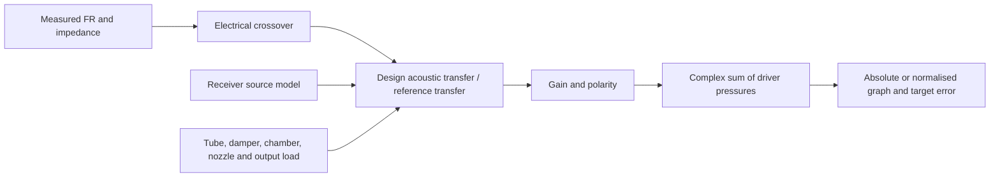

# IEM Designer workflow audit — 2026-09-26

This review covers the driver library and imports, circuit CAD, acoustic calculation, polarity, graph and metrics, reverse design, and browser project persistence. The shipped engine is now **0.18.0**. Changes are local; this review does not deploy the website or certify agreement with measured earphone responses.

## How the calculation works



For a database driver, the calculation is conceptually:

`Pdriver = Pmeasured × Helectrical × (Hdesign / Hreference) × 10^(gain/20) × polarity`

`Pcombined = sum(Pdriver)` and `SPLcombined = 20 log10(|Pcombined|)`.

These are complex quantities: phase affects summation. Polarity is +1 or −1. A 180° inversion leaves one driver's magnitude unchanged, but changes how it combines with the others. Database curves currently supply magnitude only; their baseline phase is assumed to be zero. Imported FR files can supply measured phase. Without a known measurement reference, an imported curve receives the design transfer directly, so importing a response already measured through that same tube can double-count the tube. Custom imported-fixture calibration is not currently exposed like the database reference editor.

| Area | Actual behaviour and checks |
| --- | --- |
| Driver library | Loads driver metadata, measurement sets, FR, impedance and reference geometry. All ten captured default driver fixtures are exercised. Documented references and assumed reference profiles remain labelled separately. |
| Files | Numeric Hz, dB/ohms and optional phase columns; invalid rows are skipped, duplicates use the last valid row, frequencies are sorted. Phase within ±180° is treated as wrapped; any values outside that range identify an unwrapped curve. Convert 0–360° wrapped exports to ±180° first. |
| Electrical CAD | Wires define a graph, not a left-to-right order. Crossed wires need an explicit junction to connect. The driver load uses complex impedance. R, L and C are solved electrically; high/low-pass response filters are ideal transfer functions. Driver − shares ground. |
| Acoustic path | Serial stages run receiver → coupler. Tube, nozzle and cylindrical chamber stages use transfer matrices. Dampers are series acoustic resistances; catalog CGS ohms are multiplied by 100,000 for the SI engine. Position matters. |
| Source and load | A fixed finite resistance is the library default. A custom resistance, experimental resonant RLC source, and ideal-pressure diagnostic are available. Source parameters remain the same in reference and design calculations. |
| Reference unity | Matching reference geometry and load makes the acoustic ratio unity. This tests cancellation of the model, not the model's accuracy for changed geometry. |
| Display | Relative mode independently centres each driver, baseline, target and combined curve at the selected frequency **after** complex summation. The undamped comparison shares its damped driver's offset to preserve attenuation. Absolute mode retains level differences. Target RMSE uses the same absolute/relative convention and refreshes with the graph. |
| Metrics | Quarter-wave and transit time are geometric estimates. Crossover is the closest magnitude match of the first two drivers, not a complete multiway crossover analysis. Outside available measurement/target frequencies, interpolation holds the endpoint value. |
| Reverse design | Searches candidates for one selected driver while scoring the combined system. It changes the first tube, first damper, gain, and a replacement series R/C circuit. A zero damper candidate removes all dampers. Other path sections, polarity, source parameters and response filters are preserved. Gain range means a range about 0 dB, not about current gain. This is a bounded candidate search, not an arbitrary circuit-topology optimizer. |
| Project persistence | Save/Load use this browser's local storage. Driver settings, circuit, reference overrides, targets and view/search settings persist. Project changes invalidate calculations, optimizer results and pending imports. |

## Problems reproduced and fixed in this review

1. **Wrapped phase interpolated through the wrong angle.** A pair of +179°/−179° samples previously became 0° halfway between them. Two nearly in-phase drivers could therefore cancel. FR and impedance interpolation now follow the short arc for wrapped curves in both WASM and the browser fallback. Explicitly unwrapped phase retains full turns.
2. **Old product-target requests could overwrite newer selections or projects.** Requests now carry a revision, New/Load invalidate it, and a pending selection clears the previous target. Failed, empty or invalid data produces a visible target message. Both supported table names are tried.
3. **Slow reverse-target file imports could overwrite newer files, drawn/filtered targets or another project.** Import revisions reject obsolete results and obsolete errors.
4. **Target RMSE could be stale and always used relative matching.** It now updates on redraw and includes level differences in Absolute SPL mode.
5. **Measurement query failures looked like missing data.** Failed FR, impedance or reference-path reads could previously produce an addable flat/assumed-reference driver. Affected library cards now show DATA UNAVAILABLE and cannot be added until reloaded successfully; successfully loaded drivers remain available.
6. **Two normalization choices performed the same operation.** Removed the redundant selector and described the existing independent normalization directly. Existing project response behaviour is preserved. “Real / calibrated SPL” is now labelled “Absolute SPL,” since choosing a display mode cannot calibrate a model.

The active filter-properties dialog was also traced: Apply already invalidates and recalculates the response correctly. An unused older input handler is not evidence of an active filter bug.

## What still limits prediction accuracy

- The measured magnitude baseline does not identify the receiver's complex acoustic source impedance or full electromechanical feedback. The constant-resistance model cannot predict how every receiver resonance changes with damping.
- The optional RLC source is one experimental mode. Its R, resonance frequency and Q require fitting to undamped and damped measurements with known fixtures. It is not automatically calibrated for each library driver.
- The simplified 711 load contains the main tube and microphone termination, without the damping side cavities. Assumed adapters and sparse digitized FR landmarks add further uncertainty, especially in treble.
- Magnitude-only database phase limits the reliability of multi-driver cancellation predictions. The sum is mathematically phase-aware, but a correct summation algorithm does not supply missing receiver phase measurements.
- The acoustic paths are independent serial paths. Shared bores, branching acoustic networks and mutual loading are not modelled.
- Driver type (BA, DD, planar, etc.) is metadata; it does not select a dedicated transducer model. Behaviour comes from the supplied FR, impedance and acoustic-source settings. Selecting a type alone cannot supply missing receiver physics.
- The browser fallback is approximate. Damper or resonant-source calculations require WASM and stop visibly if it is unavailable.

To validate an actual design, use the same drive level, known coupler, tube dimensions and damper position for undamped and multiple damped measurements. Fit a source model on one comparison, then check another measurement withheld from fitting. See [the polarity and damping guide](POLARITY_AND_DAMPING.md) and [the earlier frequency-response audit](FREQUENCY_RESPONSE_AUDIT.md).

## Verification

The original 79 tests passed before the workflow review. Eight regression tests were added; seven reproduced failures in the previous code, while the unwrapped-phase test protects existing behaviour. The subsequent [Sonion damping benchmark](SONION_2356_DAMPING_BENCHMARK.md) adds two comparison tests and extends all ten library checks. **All 89 tests now pass.** The acoustic tests exercise the shipped WASM, not a separate implementation:

```sh
node --disable-warning=ExperimentalWarning --test tests/*.test.mjs
```

The ten driver fixtures cover reference cancellation, changed tubes, dampers, finite responses, and forward/reverse consistency. Additional tests cover circuit topology and migration, polarity cancellation and persistence, resonant peak height/bandwidth, source/reference consistency, target/import races and query failures. Synthetic analytic tests establish software behaviour; they do not replace acoustic measurements.

Browser verification loaded engine 0.18.0, edited polarity and a 680 CGS-ohm damper, saved/reloaded the project, copied the combined curve to Reverse Design, ran a constrained search and applied the result. The known candidate returned 0.01 dB RMSE after target resampling; the resulting forward chart completed without browser errors or warnings. This used an isolated local Sonion 2356 fixture preview, not the production database or authentication flow.
