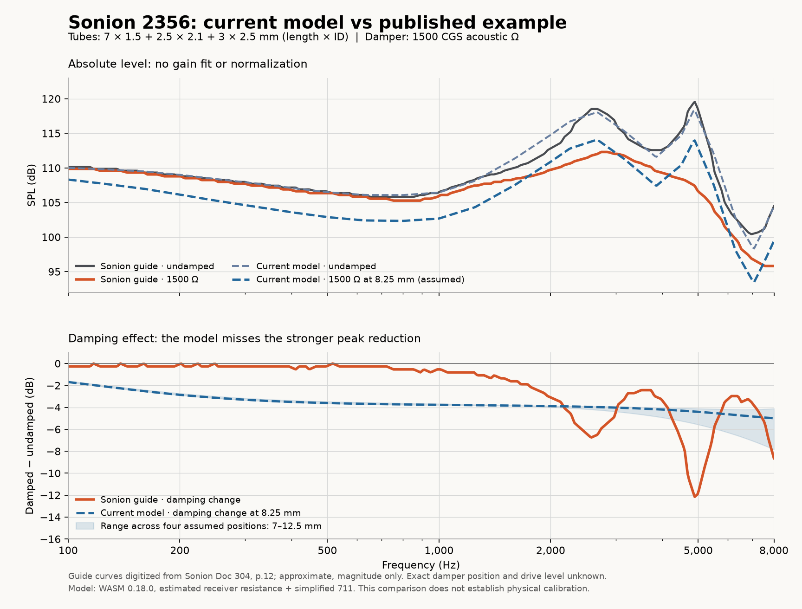

# Sonion 2356 damping benchmark — 2026-09-26

**The new example confirms a physical-model mismatch. It is not fixed by the previous software corrections.** The current model is relatively close to the published undamped response but applies too much broad attenuation and too little attenuation at the receiver peaks when a damper is added. Matching the reference response is not evidence of correct damping: the design/reference transfer ratio is unity by construction when both setups are identical.

## Source and setup

The original [Sonion Academy guide, Doc 304, version 001, dated 2013-12-23](https://datasheet.datasheetarchive.com/originals/crawler/america.sonion.com/64f5a330a4357be5bd691f46e9beae16.pdf), page 12, specifies a 2356 receiver, 1500 acoustic-ohm damper, and serial tubes of **7 × 1.5 + 2.5 × 2.1 + 3 × 2.5 mm**, where each pair is length × inner diameter. Its equipment section identifies an IEC 711 ear simulator. Exact damper placement, drive voltage, adapter and insertion depth are not specified for the example. The resistance value is more reliable than the SSD identifier: another graph in the guide has inconsistent SSD 01/02 labels.

The two vector curves were digitized from page 12, with axis coordinates and provenance retained in [the benchmark fixture](../tests/fixtures/sonion-2356-design-example.json). These are approximate published curves, not original measurement samples. The fixture is separate from the production driver library.

The diagnostic uses the shipped WASM 0.18.0 engine, the existing library baseline and its original **4.5 × 1.4 + 11 × 1.9 mm** reference tubes, estimated source resistance, simplified 711 output, direct electrical connection, normal polarity and 0 dB gain. Neither response is normalized or fitted. Since damper placement is unknown, four scenarios are compared, measured from the receiver.

## Measured discrepancy

Errors use 120 equally spaced log-frequency samples from 100 Hz to 8 kHz. The undamped model has approximately **0.75 dB RMS error** against the guide. Absolute errors also depend on the unknown relative drive levels; the change between damped and undamped curves is the more useful diagnostic.

| Assumed damper position | Damped SPL RMS error | Damping-change RMS error |
| --- | ---: | ---: |
| 7 mm | 2.67 dB | 2.76 dB |
| 8.25 mm, middle of the 2.1 mm-ID section | 2.62 dB | 2.71 dB |
| 9.5 mm | 2.58 dB | 2.67 dB |
| 12.5 mm, tube exit | 2.54 dB | 2.63 dB |

At the guide's undamped peak near **2.57 kHz**, its damped curve is approximately **6.8 dB lower**; the model predicts 3.9–4.2 dB. Near **4.89 kHz**, the guide changes by approximately **−12.2 dB**, versus −4.1 to −5.5 dB in the model. Moving the damper between these positions does not remove the discrepancy. These pointwise changes are not measurements of Q; no exact Q is inferred from the small published plot.



## Why it happens

1. **The receiver source is not identified.** A fixed manufacturer magnitude curve is multiplied by a modelled transfer ratio. The default source resistance is constant with frequency, so it does not represent the receiver's complex acoustic impedance or all of its resonances. A series damper interacts with the modelled impedance, not with an independently identified model of every peak embedded in the baseline. The optional one-mode RLC source is also uncalibrated; changing its default frequency/Q would not establish a valid 2356 model.
2. **The 711 approximation is incomplete.** It models the main tube and microphone termination but omits the side cavities and their losses. These are part of the frequency-dependent acoustic loading; see [COMSOL's generic 711 model](https://doc.comsol.com/6.3/doc/com.comsol.help.models.aco.generic_711_coupler/generic_711_coupler.html). A credible correction needs both receiver and fixture identification. Selecting “711” cannot supply the missing parameters.
3. **The old dashed trace is a different fixture.** It is the datasheet baseline through its original tube assembly. Comparing it with the new damped assembly mixes the effects of changed tubing and damping.

The CGS-to-SI conversion and series-resistance matrix already have independent analytic tests. They should not be rescaled or replaced with graph smoothing to force agreement with this example.

## Changes made

- Added **UNDAMPED COMPARISON** for every driver with a positive design damper. It removes all design dampers while keeping the tubes, reference fixture (including reference dampers), source, circuit, gain and polarity unchanged.
- The extra responses never enter the combined acoustic sum or optimizer. In relative display mode, each comparison uses its damped driver's normalization offset, retaining the attenuation difference. Its visibility works independently of INDIVIDUAL and persists in saved projects.
- Renamed the old dashed curve to **Datasheet, reference fixture** and explained the distinction in the graph notes.
- Added the source fixture, executable measurement diagnostic and plotting script. The production receiver/coupler parameters remain unchanged because this evidence does not establish calibrated replacements.

## What a physical correction requires

Use a characterized 711 model with side branches, microphone pressure transfer and fixture geometry. Identify each receiver's complex source impedance, or a passive model with enough resonant modes, from measurements under multiple known acoustic loads. Fit the undamped and one damped response together, with known drive level and placement; validate another damper value or tube geometry withheld from fitting. A fit that only reproduces this one magnitude plot cannot certify the other drivers or arbitrary assemblies.

The user's example is now a repeatable benchmark for that work. It does **not** demonstrate that damping is accurate for all library drivers, and this change does not claim that result.

## Reproduction and software verification

From the repository root, with Node installed:

```sh
node tests/diagnostics/sonion-2356-benchmark.mjs /tmp/sonion-2356-benchmark.json
node --disable-warning=ExperimentalWarning --test tests/*.test.mjs
```

The diagnostic prints the errors and can save full curves to the supplied JSON path. It deliberately has no passing physical-accuracy threshold. To recreate the figure in a Python environment containing matplotlib and numpy:

```sh
python tests/diagnostics/plot-sonion-2356-benchmark.py /tmp/sonion-2356-benchmark.json docs/diagnostics/sonion-2356-damping-benchmark.png
```

**89 software tests pass.** The ten library fixtures now verify the undamped comparison against direct WASM calculation. Additional tests cover combined-sum exclusion, multiple design dampers, preservation of reference dampers, polarity/source/gain consistency, relative attenuation, independent visibility and persistence. These tests establish software behaviour, not agreement with physical measurements.

Browser verification used an isolated local 2356 fixture preview with the assumed 8.25 mm damper position. Calculation, the comparison legend, independent visibility and Save/Load worked with WASM 0.18.0 and no browser errors or warnings. Production authentication and database access were not part of that fixture preview. Changes remain local and have not been deployed.
