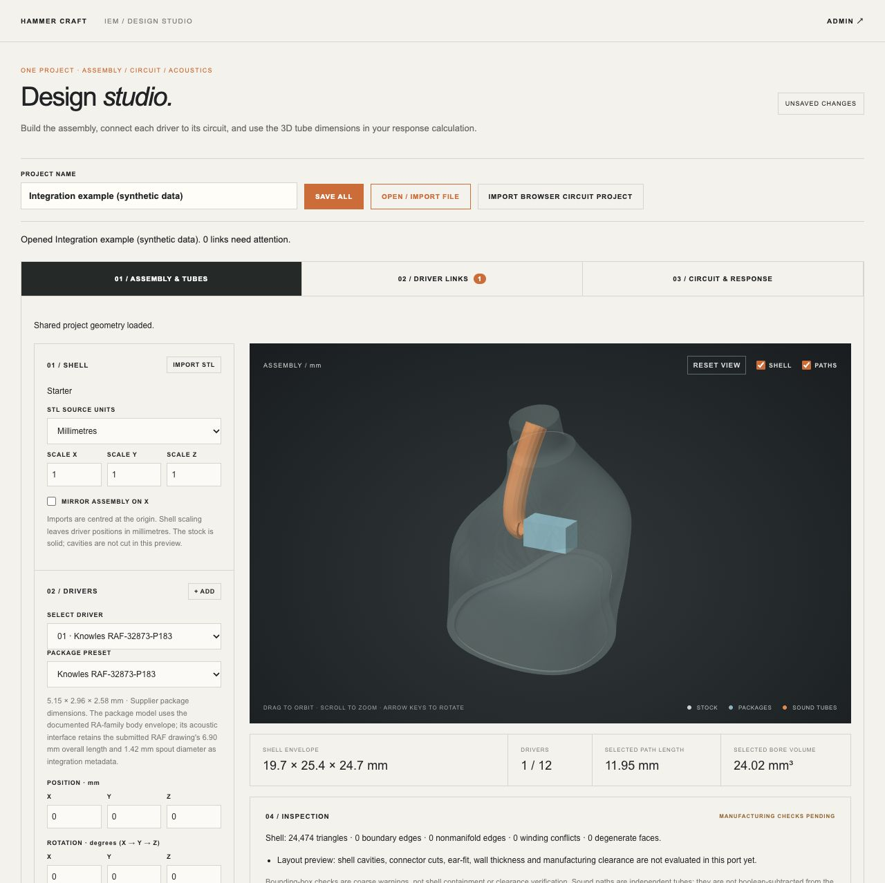
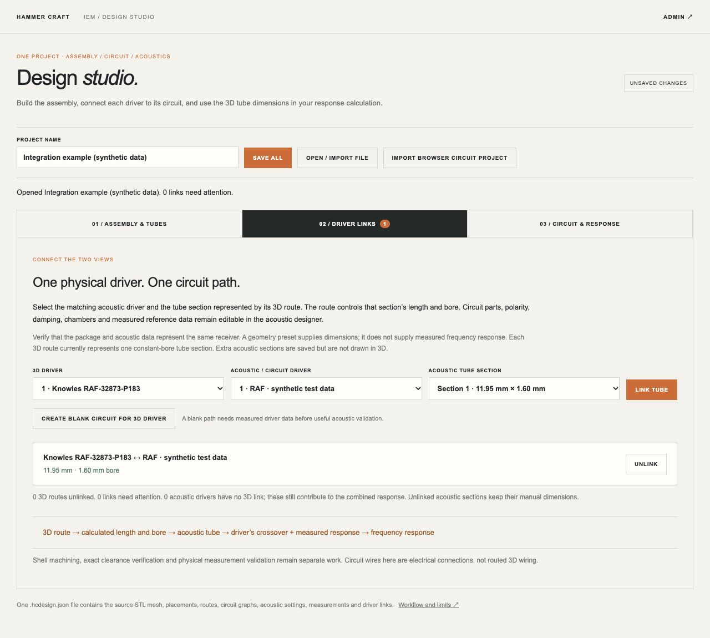

# Design Studio integration report — 2026-09-30

Result: the initial shared assembly/circuit/acoustic workflow is implemented and tested locally. It is not a manufacturing release or a physical frequency-response validation.

## Automated checks

`node --test tests/*.test.mjs`: **149 passed, 0 failed, 0 skipped**, including 12 new shared-project tests. See [the complete test output](tests.txt).

| Coverage | Result |
| --- | --- |
| Shared JSON round trip | Source mesh, placements, routes, circuit graph, calibration, polarity, measured-data fields and links preserved. |
| Dimension ownership | Accepted Rust route supplies only the linked section's length and bore; loss, dampers and extra sections are retained. |
| Stable identity | Reordering sections preserves the link; duplicate driver/section assignments and malformed IDs are rejected. |
| Geometry edits | Rust-calculated length changes propagate; assembly reflection preserves length. |
| Stale links | Removed geometry/acoustic drivers, replaced tubes, changed package and missing metrics are reported. |
| Acoustic editor | Linked dimensions are read-only; stale links block forward calculation; reverse optimisation cannot overwrite a managed tube, and its apply button retains the warning rather than falsely reporting success. |
| Unlink | Last accepted dimensions remain, binding is removed, manual editing resumes. |
| All 18 geometry presets | Each preset's Rust route metrics feed a finite acoustic response identical to manually entering those same dimensions; the changed dimensions alter the response. |
| Existing regressions | All previous 137 circuit, acoustic, validation and workshop tests pass. |

The 18-preset integration test uses one synthetic acoustic fixture across the geometry catalog to isolate the connection between the two engines. It does **not** assert that all 18 packages have matching measured acoustic calibration or physically validated predictions. Existing native tube-parity and catalog tests remain in the suite.

JavaScript syntax checks and `git diff --check` also pass. No Rust equations or WASM binary were changed for this integration; the previously built geometry and acoustic exports are used.

## Browser verification

Tested the actual page through the loopback preview at `http://127.0.0.1:8765/design-studio.html`, using a local auth fixture and synthetic acoustic data. No private account data was accessed.

1. Both embedded editors load; the common project actions and three tabs are functional.
2. Linked the starter RAF route to an acoustic tube. The acoustic fields displayed **11.946959560794864 mm** and **1.6 mm**, with a managed-field note and disabled section-removal control.
3. Opened a shared fixture containing a connected **5 Ω resistor**, inverted polarity, **3 dB gain**, **0.1 V baseline**, two FR points, two impedance points, a **1500 CGS Ω damper** and another **3 × 2 mm tube**. The circuit and simulation reported success.
4. Renamed the acoustic path and changed the damper to **2200 CGS Ω**. Changed the 3D endpoint Y from **11 to 16 mm** and bore from **1.6 to 1.8 mm**. The acoustic length became **16.76301513835214 mm**, bore became **1.8 mm**, and simulation completed. The renamed driver, resistor, damper, gain, polarity, measurement data and second section remained intact.
5. Imported a project with invalid zero shell scale. The page reported the validation error and restored the previous linked dimensions and circuit state.
6. Changed the geometry package to ED-29689. The link reported a changed package and the acoustic simulation stopped with that error.
7. Unlinked the route. Both length fields became editable, the last dimensions remained, and calculation succeeded again.
8. Save all displayed **DOWNLOAD READY** and a persistent `.hcdesign.json` download link. Reopening a valid shared fixture restored both editors and the link. Browser automation could not independently confirm the downloaded file's final location on disk; JSON content/round trips are covered by automated tests.
9. Reopened a clearly labelled synthetic example for the delivered preview. Browser console inspection showed no error/warning entries at the inspected checkpoint.

## Limits and next steps

The shared model currently connects one constant-bore route to one acoustic tube section. Extra dampers, chambers, nozzles and stepped sections are preserved but not laid out in 3D. Package-to-measurement identity is an explicit user choice. Shell stock and tube solids are separate; this does not machine channels, route physical circuit wires or certify clearance/printability. No new IEC 711 coupler measurements were performed. Production authenticated access and deployment were not exercised in this local test.

Next geometric milestone: represent tubes as ordered sections with bore transitions and explicit damper positions, then derive both the 3D solids and acoustic path from those same sections. Shell channel subtraction and physical component-clearance checks can follow that shared representation.

See [workflow and architecture](../../DESIGN_STUDIO.md).

