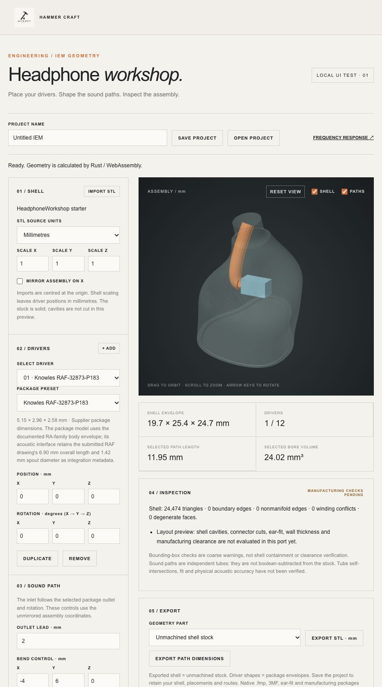

# HeadphoneWorkshop Rust/web port — test report

Date: 2026-09-30. Scope: initial IEM geometry milestone; not full native feature parity or physical acoustic validation.

## Result

**137/137 automated tests pass**, including **25 new workshop tests**. The native driver-selection, IEM driver-path and implicit-surface test targets also passed before the port. Rust compilation and browser WebAssembly build succeeded. `cargo test` currently contains no native Rust unit tests; the new behavioral tests execute the actual compiled browser WASM from Node.

See [automated test output](tests.txt), [Rust build output](rust-build.txt), [native baseline output](native-tests.txt) and [numerical results](geometry-results.json).

## C++ / Rust geometry parity

Three independently generated C++ fixtures cover curved constant-bore paths, tapered inlet paths and a zero initial derivative with tangent fallback. Each has 600 vertices and 1,200 triangles. Triangle indices match exactly. Maximum coordinate differences are 3.56e-15 mm, 3.56e-15 mm and 2.23e-16 mm respectively; the acceptance threshold is 1e-10 mm.

The copied native starter contains 24,474 triangles, 0 boundary edges, 0 nonmanifold edges, 0 winding conflicts and 0 degenerate faces after import. Tests check centring, source-unit conversion, anisotropic scaling and mirrored winding/volume.

## Every native driver preset

The columns below cover generated package/tube edge topology, translated/rotated outlet attachment and mirrored volume, plus binary STL export/import and project-data round trips. They do **not** establish acoustic-response accuracy, tube self-intersection freedom or manufacturing clearance.

| Preset | Geometry | Transform / mirror | STL / project round trip |
| --- | --- | --- | --- |
| 9 mm Dynamic Reference | PASS | PASS | PASS |
| 10 mm Dynamic Reference | PASS | PASS | PASS |
| Knowles RAB-32257 | PASS | PASS | PASS |
| Knowles WBFK-23990 | PASS | PASS | PASS |
| Knowles TWFK-30017 | PASS | PASS | PASS |
| 14.2 mm Planar Reference | PASS | PASS | PASS |
| USound Adap UT-P2019 | PASS | PASS | PASS |
| Knowles CI-22955 | PASS | PASS | PASS |
| Knowles RAU-34832 | PASS | PASS | PASS |
| Sonion 4100 | PASS | PASS | PASS |
| xMEMS Cowell | PASS | PASS | PASS |
| xMEMS Muir | PASS | PASS | PASS |
| Knowles RAD-33518 | PASS | PASS | PASS |
| Knowles RAF-32873-P183 | PASS | PASS | PASS |
| Knowles ED-29689 | PASS | PASS | PASS |
| Knowles SR-32453-000 | PASS | PASS | PASS |
| 5.0 mm Marketplace Planar Treble | PASS | PASS | PASS |
| 5.7 mm Marketplace Planar Treble | PASS | PASS | PASS |

Additional tests cover 12-driver capacity, duplicate IDs, invalid schema versions, bad indices, non-finite STL vertices, truncated binary data, malformed ASCII facets, invalid units, impossible bore/wall dimensions, excessive tessellation, zero-length curves, and preservation of worker state after rejected edits/imports.

## Browser checks

Local loopback UI fixture; production authentication was not exercised. No live account data or database writes were used.

Verified visually through the browser:

- Starter load, WebGL rendering and metric presentation.
- Add a second driver, change its preset to WBFK, translate it and rotate it 25 degrees; route metrics update.
- Switch selection back to RAF, resize shell X to 1.2 and mirror the assembly.
- Reject a 5 mm bore inside a 2.4 mm outside diameter; preserve the previous accepted geometry and metrics.
- Open a versioned project file through the browser's real file chooser.
- Import the original shell STL through the real file chooser.
- Prepare project and STL downloads with visible file links.
- Phone breakpoint: 390 px viewport, 390 px document width, 354 px canvas; no horizontal overflow.

Browser automation did not capture completed downloads: both download-event capture and link-download capture timed out in the in-app browser. Therefore filesystem completion of browser downloads and reopening that exact downloaded file are **not verified**. The equivalent worker file contents, binary export, save and reopen operations pass automated tests; the browser import check used a generated fixture. A persistent download link is available when automatic downloading is not supported.

## Remaining work

The full port still requires shell booleans and machining, connectors/faceplates, ear-fit, precise containment and clearance rules, native .fmp migration, manufacturing/3MF packages, geometry/acoustic project synchronisation and the other product families. See [port status and build instructions](../../HEADPHONE_WORKSHOP_PORT.md).

The native synthetic AI model was not substituted for the website's acoustic solver. No new physical measurements were taken, and the previous frequency-response/damping validation gaps remain open.

