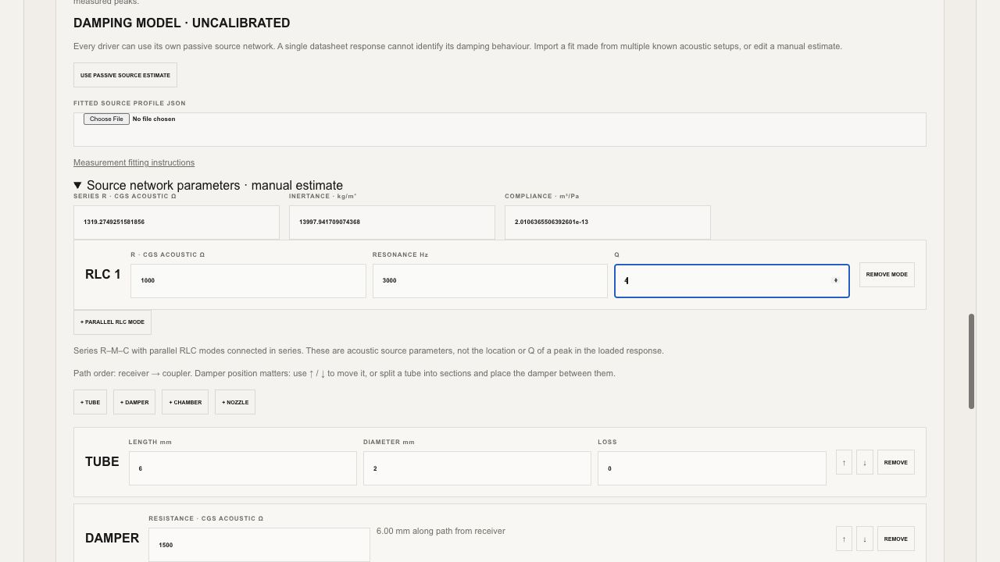

# All-driver damping support — 1 October 2026

**The improved source-network workflow is implemented for all ten acoustic-library drivers. Physical damping accuracy is not yet established for all of them.** Sonion 2356 retains its optional published-guide fit. The other nine have editable, explicitly uncalibrated starting networks and a measurement-to-profile fitting workflow; no receiver has been assigned the 2356 parameters merely because it is another balanced-armature driver.

## Changes

- Every receiver's acoustic-path panel offers a passive source network: series acoustic R, inertance and compliance, plus parallel RLC modes connected in series. External dampers act on that complex network through the production Rust/WASM acoustic solver. Source parameters remain fixed as damper resistance, bore and position change.
- Per-driver profile import checks the exact baseline, voltage calibration, impedance data and reference fixture. Editing a fitted network removes fit provenance. Baseline/reference changes invalidate its use until the receiver is refitted or returned to a manual estimate. Malformed imports are rejected without replacing the project; stale asynchronous imports cannot overwrite later edits.
- Source selection, individual parameters and fit provenance survive project save/load. Current tubing, wiring, gain and polarity are preserved on source-profile import. The chart compares a damped path with the same path with its external dampers removed.
- New 711 library entries use the fuller side-cavity equivalent circuit. The 2 cc driver retains its volume-based cavity approximation. Older saved projects retain their chosen load and can explicitly upgrade it. The nominal circuit does not characterize a specific DB2012 adapter or high-resolution coupler.
- The offline batch fitter reads fitting cases only. It produces receiver-specific source JSON files when actual data is available, reports missing data explicitly, and never promotes a fit to independently validated status. A second packet can freeze those profiles for subsequent held-out measurement.

This extends frontend and offline tooling around the existing **Acoustic Engine 0.25.0**; this update does not change the Rust solver or its WASM binary.

## Every acoustic-library driver

“Pass” below is a software result: 17 functional checks and 475 tube/damper sweep cases for each receiver. The sweep exercised each driver's uncalibrated passive network, including 2356; its optional guide fit has separate [published-curve results](../2026-10-01-damper/README.md).

| Receiver | New-reference load | Source evidence available in this project | Software checks |
|---|---|---|---|
| Sonion 2356 | 711 with side cavities | Optional guide fit; assumed damper position; not independently validated | 17/17 + 475/475 pass |
| Knowles CI-22955-000 | 711 with side cavities; assumed DB2012 adapter | Single library baseline; manual network, damping measurements needed | 17/17 + 475/475 pass |
| Knowles RDI-34006-000 | Nominal 711; documented tubeless reference | Single library baseline; manual network, exact Hi-Res fixture needed | 17/17 + 475/475 pass |
| Sonion 28UAP01 | 2 cc volume approximation | Single library baseline; manual network, damping measurements needed | 17/17 + 475/475 pass |
| Sonion 38D1XJ007Mi/8a | 711 with side cavities | Single library baseline; manual network, damping measurements needed | 17/17 + 475/475 pass |
| Sonion EST65DA01 | 711 with side cavities | Single library baseline; manual network, transformer and upper-band characterization needed | 17/17 + 475/475 pass |
| Sonion 17A003 | 711 with side cavities | Single library baseline; manual network; 0.07 V baseline retained | 17/17 + 475/475 pass |
| Sonion 33AJ007i/9 | 711 with side cavities | Single library baseline; manual network, damping measurements needed | 17/17 + 475/475 pass |
| Knowles HODVTEC-31618-000 | 711 with side cavities; assumed direct coupling | Single library baseline; manual network, fixture confirmation needed | 17/17 + 475/475 pass |
| Knowles RAU-34832-B148 | Nominal 711; documented 1.75 × 1 mm reference tube | Single library baseline; manual network, exact Hi-Res fixture needed | 17/17 + 475/475 pass |

The acoustic library has ten receiver baselines. This is distinct from the larger 3D package catalog: a geometric envelope does not supply an acoustic calibration. Custom acoustic drivers can use the same network and import controls, but arbitrary custom datasets were not individually validated by this ten-driver audit.

## Verification

- **300/300 Node/WASM regression tests passed**, including all ten individual source networks, project persistence, source/reference binding, input synchronization and rejection, missing-WASM handling, measurement fitting, and existing circuit/geometry regressions. [Full output](regression-tests.txt)
- **7/7 native Rust unit tests passed**; doc tests also passed with zero cases. [Output](rust-tests.txt)
- **170/170 all-driver functional checks passed**, plus **4,750 numerical sweep cases**. The audit performed 5,153 production-WASM simulations, evaluating 1,246,186 driver response points, excluding internal optimizer candidate evaluations. [Machine-readable report](software-audit.json)
- Sweep ranges: lengths 3, 6, 12, 20 and 30 mm; bores 0.8, 1, 1.5, 2 and 3 mm; dampers 0, 320, 680, 1000, 1500, 2200 and 4700 CGS acoustic Ω; positive dampers at inlet, midpoint and outlet. Each case checked finite SPL/phase and unchanged source parameters over 240 log-spaced frequencies from 20 Hz to 20 kHz. Some frequencies lie outside a receiver's measured baseline: those results establish numerical stability only.
- Functional checks cover reference unity, zero-damper/split-tube invariance, six output loads, five generic source models, electrical-divider agreement, gain, polarity, coherent summation, chart comparisons, save/load, reverse-path operation and common-voltage scaling. Test isolation was corrected so source-model probes restore the original network before subsequent comparisons.
- Synthetic fitter tests recover a series R–M–C source and a source with one additional parallel mode, then predict a withheld geometry and resistance. These tests use known synthetic truth and the production solver. They test algorithm behavior and separation of fitting/validation data; they are **not independent physical validation**.
- All **133 acquisition templates** contain empty point arrays and match their frozen setup hashes. There are **30 fit cases** and **103 held-out cases**. The missing-data batch reports all ten receivers as awaiting measurements and creates no fabricated profiles. [Data-readiness result](fit-readiness/report.json), [receiver inventory](driver-readiness.json)
- Browser verification in the local fixture preview used Knowles CI-22955-000: imported the example, selected the per-driver network, added a mode, edited Q, switched source models and recalculated successfully. Q = 0 correctly blocked simulation; Q = 4 survived source selection and restored calculation. Source fields now synchronize on input and before calculation/export, preventing displayed edits from being ignored. No browser warnings/errors were recorded. Account-backed library access was not part of this local UI check.



The [browser response preview](browser-response.jpg) shows the Knowles CI manual estimate with and without its external damper. It verifies that calculation responds to this setup; it is not a measured receiver comparison.

## Why the other drivers still need data

Each of the other nine receivers currently has one magnitude baseline in the project. A measured curve includes both receiver and measurement-fixture behavior, so it does not uniquely determine the source impedance required to predict damping across other loads. The existing guide fit cannot supply that missing information for unrelated receivers.

The [Knowles CI datasheet](https://www.knowles.com/docs/default-source/default-document-library/receiver-datasheet-ci-22955-000-1efdd1a731dff6ddbb37cff0000940c19.pdf?Status=Master&sfvrsn=0) and [HODVTEC datasheet](https://www.knowles.com/docs/default-source/default-document-library/receiver-datasheet-hodvtec-31618-000-1.pdf?sfvrsn=0) include responses under different coupler conditions. They are potential additional identification evidence once those fixtures are represented and their conditions reconciled; they are not a known same-geometry damper pair. The [RAU product sheet](https://www.knowles.com/docs/default-source/model-downloads/receiver-datasheet-rau-34832-b148.pdf?Status=Master&sfvrsn=713c73b1_4) likewise does not supply the paired damper measurements used by the 2356 guide fit. No such extra curves were silently treated as a calibrated profile in this update.

The supplied baselines also lack measured acoustic phase. Fine treble details, exact Hi-Res couplers, receiver-integrated venting, nonlinear effects, manufacturing variation and multi-driver/shared-bore interactions remain outside the demonstrated accuracy. The pilot fitting/validation band is 100 Hz–8 kHz where supported; EST65DA01 starts at 1 kHz.

## Use and reproduce

Open a driver and choose **Passive source network (per driver)** in its acoustic-path panel. Use the controls for manual estimates, or import an individual measured fit. See [calibration and fitting instructions](../../ACOUSTIC_SOURCE_CALIBRATION.md).

The [measurement packet](measurement-packet.zip) supplies a concrete acquisition plan for all ten receivers. It contains no measurements. Record actual fixture dimensions and calibration before collecting data. Fit the designated fit cases, freeze a new packet with the resulting profiles, then acquire held-out cases and run the independent comparator. [Full measurement protocol](../../IEM_VALIDATION_PROTOCOL.md)

To reproduce the software checks from the repository root:

```sh
node --test tests/*.test.mjs
node tests/diagnostics/all-driver-system-audit.mjs \
  tests/fixtures/driver-library.json /tmp/all-driver-audit.json --passive-source
cargo test --manifest-path docs/acoustic-engine/Cargo.toml
```

The [Knowles CI UI example](knowles-ci-manual-example.json) preserves its existing finite-resistance model so you can exercise **USE PASSIVE SOURCE ESTIMATE** in Design Studio. It is a UI fixture, not a receiver calibration or a manufacturing design.
