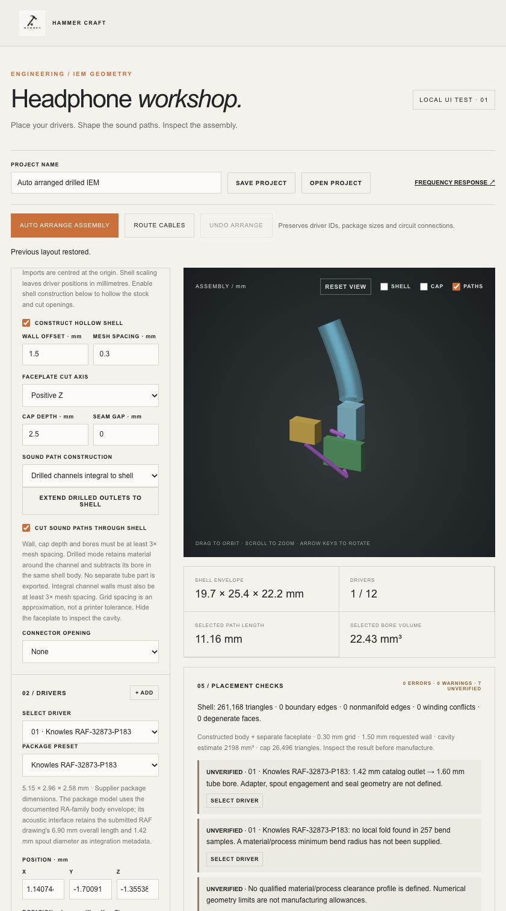

# Arrangement and drilled-channel verification — 1 October 2026

Engine: **0.23.0**, compiled browser WebAssembly included in this change.

| Verification | Result |
| --- | --- |
| Full Node/browser-WASM regression suite | 268 passed, 0 failed |
| Rust unit tests | 6 passed, 0 failed |
| All 18 catalog presets, starting outside an analytic stock | Auto arrangement returns contained geometry, preserving IDs, preset and bore/outside dimensions |
| Native starter shell: driver + connector + crossover envelope | Placement and two harness routes pass; deterministic results and correct mirrored geometry |
| Hollow native starter shell | Placement/routing respects the requested cavity and cap plane |
| Two-driver analytic shell | Separate sound paths, three harness routes, original driver order retained |
| Schematic arrangement | Electrical graph, values and complex frequency response unchanged; Undo restores the circuit |
| Impossible layout / malformed dimensions | Explicit failure; accepted worker project remains available |
| Moved part after routing | Stale anchor blocks export until cables are rerouted |
| Drilled analytical shell | Independent ray parity on the final mesh verifies air inside the bore and retained solid around it |
| Dead-end / under-resolved drilled channels | Rejected before export |
| Native starter drilled workflow | Extend outlets, then arrange; closed topology and no export blockers; rebuild after JSON round trip agrees |
| Browser UI | Arrange, Undo, shell construction, outlet extension, combined electronics/harness layout, and project reopening exercised |

The final combined starter example has **29 checks, 0 errors, 0 warnings and 7 explicitly unverified engineering requirements**. Its shell export contains the drilled channel. Channel/harness guides are excluded from standalone STL export. Parameters and check details are in [example-parameters.json](example-parameters.json).

All-preset testing uses a roomy analytic stock to verify the algorithm and identity/containment invariants. It does **not** claim every catalog part fits the native ear shell. Native-shell tests use the RAF preset. Multi-driver packing is a bounded search and may require manual edits.

Connector/board dimensions and rear terminal anchors are planning inputs, not controlled supplier drawings. Individual crossover parts, pin-level electrical routing, connector retention/cut alignment, assembly access, qualified bend radii, ear fit and physical acoustic accuracy remain outside this verification. See [usage and limitations](../../AUTO_ARRANGE.md).

Browser Save generated the expected project download link. The in-app browser automation's blob-download wait timed out; downloadable-file delivery was not established by that tool. Worker save/reopen is covered automatically, and the final combined project was reopened through the browser's file chooser using a local test fixture.

