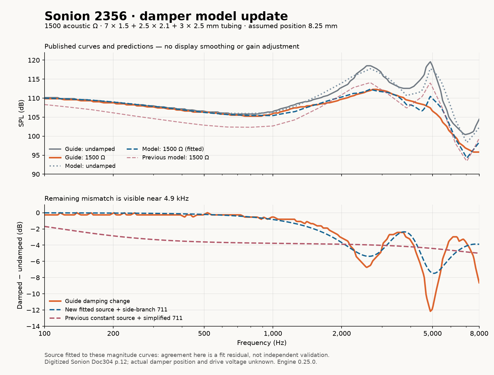
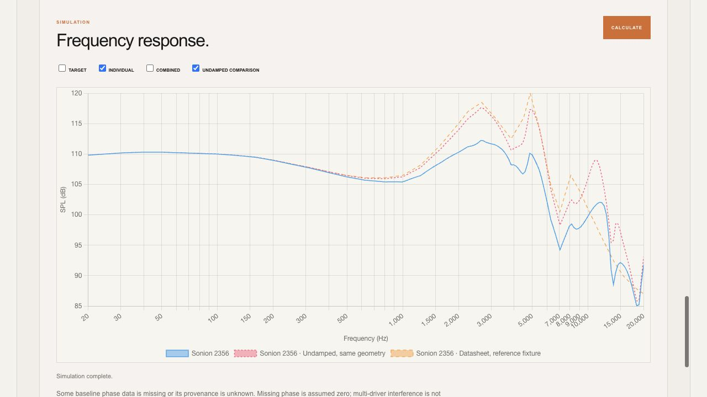

# Sonion 2356 damper model update — 2026-10-01

The new optional **Sonion 2356 · example fit v1** source model preserves the low-frequency level and produces stronger reduction of the receiver peaks with a 1500 acoustic-ohm damper. It also uses a 711 equivalent circuit with both side branches and their losses. This improves agreement with the supplied example, but **does not reproduce every peak or establish physical validation**.

## Use it

Refresh the IEM Designer / Design Studio to load engine **0.25.0**. On the library Sonion 2356 driver, under **Acoustic path**, choose:

- **USE 2356 DAMPING MODEL** to keep your current tubes and damper positions.
- **USE GUIDE TUBING + 1500 Ω** to replace the acoustic path with the example below.

Both select the new 711 output load. Press **CALCULATE** and compare the driver with **Undamped, same geometry**. The datasheet curve has different reference tubing and is not the undamped counterpart of your design. In projects with multiple drivers, the output load is shared by all drivers, as before.

You can also import [sonion-2356-example.json](sonion-2356-example.json) using Design Studio's **OPEN / IMPORT FILE**. This includes the original library baseline and direct electrical connection. Importing a circuit project replaces the current acoustic editor contents; save your own work first.

The fitted model is opt-in: saved custom source settings and other driver types are not silently changed. Guide tubing cannot replace a path linked to 3D geometry until the path is unlinked. Selecting the fitted model alone retains those links.

## Example and assumptions

The supplied image is the single-driver example on p.12 of [Sonion Academy, Doc304 v001, 2013-12-23](https://datasheet.datasheetarchive.com/originals/crawler/america.sonion.com/64f5a330a4357be5bd691f46e9beae16.pdf).

| Element | Specification |
| --- | --- |
| Receiver | Sonion 2356 |
| First tube | 7 mm long × 1.5 mm ID |
| Second tube | 2.5 mm long × 2.1 mm ID |
| Third tube | 3 mm long × 2.5 mm ID |
| Damper | 1500 CGS acoustic Ω = 1.5 × 10⁸ Pa·s/m³ |
| Assumed damper position | 8.25 mm from the receiver, halfway through the second tube |
| Output and measurement reference load | Nominal IEC 711 lumped model with side cavities |
| Baseline reference tubing | Library fixture: 4.5 × 1.4 + 11 × 1.9 mm |
| Environment | 20 °C, 50% RH for fitting |

The original guide does **not** give the exact damper position or drive voltage for this example. The preset splits the second tube into 1.25 mm + damper + 1.25 mm. Its position is an assumption, not information recovered from the picture. Absolute comparison uses the existing library level at its stated 0.1 V; no level offset was optimized. The guide's relative drive level remains unknown.

## What changed mathematically

The damper itself was already a correct series acoustic resistance, and its CGS-to-SI conversion was correct. The missing information was the receiver's frequency-dependent acoustic source impedance, plus the omitted coupler side cavities. A constant source resistance cannot describe how the receiver resonances interact with the added damper.

The new Rust source is a passive Foster network: a series resistance, inertance and compliance, followed by one parallel RLC branch connected in series. All component values are positive. It enters the same complex pressure-transfer calculation used for both reference de-embedding and the actual design. The baseline samples remain unchanged, and there is no graph smoothing or replacement of the computed response with the guide curve.

| Fitted source parameter | Value (SI) |
| --- | ---: |
| Series resistance | 192,212,323.553 Pa·s/m³ |
| Series inertance | 4,534.907184 kg/m⁴ |
| Series compliance | 1.8980030124 × 10⁻¹³ m³/Pa |
| Parallel branch resistance | 715,472,913.317 Pa·s/m³ |
| Branch resonance | 4,042.544343 Hz |
| Branch Q | 7.024052441 |

These are an estimated source-port equivalent, not measured diaphragm parameters. Magnitude-only data does not uniquely identify the network or its phase. Additional branches were explored but gave little joint improvement, so only one was retained.

The 711 network follows Figure 2 and Table 2 of [Gazzola et al., Forum Acusticum 2023, DOI 10.61782/fa.2023.0485](https://dael.euracoustics.org/confs/fa2023/data/articles/000485.pdf). It contains series inertances L1/L3/L5, both RLC side branches, and losses R1/R3/R5 in series with the compliances. Output pressure is taken across terminal C5. The published Table 2 values are used; the paper's later 1.5× loss adjustment for its particular MEMS measurement is not applied. This is a nominal circuit, not certification of a physical coupler. The earlier simplified 711 remains available for compatibility.

## Quantitative comparison

The following are **fit residuals**, not held-out validation results. Both digitized guide curves were used during source fitting. The reporting grid has 120 equally spaced log-frequency samples from 100 Hz to 8 kHz, with damper position fixed at the assumed 8.25 mm.

| Error against guide | Previous constant source + simplified 711 | New source + side-branch 711 |
| --- | ---: | ---: |
| Damped SPL RMS | 2.62 dB | 0.84 dB |
| Damping-change RMS | 2.71 dB | 1.00 dB |
| Undamped SPL RMS | 0.75 dB | 1.06 dB |

The damped curve improves substantially, while the undamped absolute error increases slightly. Bass attenuation stays below 0.1 dB from 100–300 Hz in this model. A significant residual remains at the sharp second guide peak:

| Frequency | Guide damping change | New model damping change |
| --- | ---: | ---: |
| 2,569.897 Hz | −6.76 dB | −5.35 dB |
| 4,888.962 Hz | −12.16 dB | −7.28 dB |



The source was fitted jointly to damped SPL, undamped SPL and their difference using positive component values, 240 log-spaced frequencies plus two peak-near anchor frequencies. Fitting uses a different grid from the reporting grid; both grids refer to the same source curves and neither is independent evidence. The full reporting outputs, including alternate assumed damper positions, are [fitted.json](fitted.json) and [legacy.json](legacy.json). Changing position from 7 to 12.5 mm changes the result; none of those alternate positions is known to be the guide's actual assembly.

## Software verification

- **282 Node/WASM tests pass; 7 native Rust tests pass.**
- An independent nodal RLC solution agrees with Rust magnitude and phase at ten frequencies from 20 Hz to 20 kHz, with 0, 320, 1500 and 2200 Ω series dampers. This checks the source network, both coupler side branches and microphone pressure transfer without reusing the engine's matrix algorithm.
- All ten library drivers were exercised with the new load at six damper values: 0, 320, 680, 1000, 1500 and 2200 Ω. All 60 cases returned finite magnitude and phase at 20, 100, 1000, 3000, 5000, 8000, 15000 and 20000 Hz. Their receiver source parameters were not replaced by the 2356 fit.
- Tests cover reference unity, exact zero-damper cancellation, production chart/WASM agreement, persistence, original baseline preservation, geometry-link protection, unsuitable receiver/reference rejection, invalid passive networks and blocking the approximate fallback when WASM is unavailable.
- Existing tests also cover CGS conversion, resistance-dependent peak and Q reduction, polarity, undamped-comparison exclusion from the combined sum and all-driver reference/geometry workflows.
- Browser testing imported the original 2356 fixture through Design Studio, applied the guide button, and successfully calculated with engine 0.25.0. The selected source/load, 1500 Ω value and assumed 8.25 mm position were checked. No browser errors or warnings were reported. Browser testing uses the existing local preview fixture; production authentication/database access was not exercised.



## What remains unvalidated

This model is fitted to one approximate published 2356 magnitude example. It has not been verified against another damper value, known placement, different tube geometry, measured phase, other receivers, or real assemblies. The plot above shows the remaining mismatch rather than hiding it. Below 100 Hz and above 8 kHz the fitted source is extrapolated, even though the app can display the full 20 Hz–20 kHz range. Other drivers need their own characterized source models; merely selecting the fuller 711 circuit does not identify them.

For physical validation, freeze this model and measure the actual 2356 fixture at known input voltage with undamped, 680, 1500 and 2200 Ω conditions and repeatable placement. Use an additional tube geometry and held-out damper values to evaluate prediction accuracy. Follow the existing [measurement validation protocol](../../IEM_VALIDATION_PROTOCOL.md); do not submit these training curves as held-out evidence.

## Reproduce

From the repository root, using the checked-in WASM:

```sh
node tests/diagnostics/sonion-2356-benchmark.mjs /tmp/legacy.json
node tests/diagnostics/sonion-2356-benchmark.mjs /tmp/fitted.json --fitted
node --disable-warning=ExperimentalWarning --test tests/*.test.mjs
```

Developer-only optional Python tools need NumPy/SciPy for fitting and NumPy/Matplotlib for plotting; they are not application dependencies:

```sh
python tests/diagnostics/fit-sonion-2356-source.py /tmp/source-fit.json
python tests/diagnostics/plot-damper-fit.py /tmp/legacy.json /tmp/fitted.json /tmp/comparison.png
```

The deterministic fit reproduces the shipped source coefficients. Engine 0.25.0 and the browser assets were rebuilt locally. No deployment or database update was performed.
