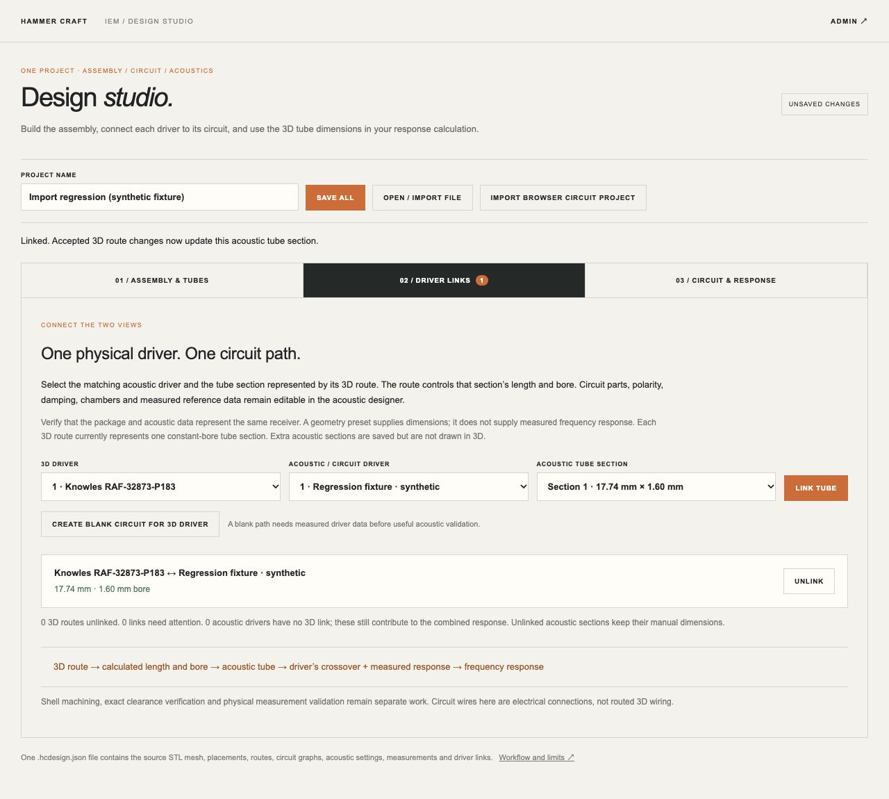
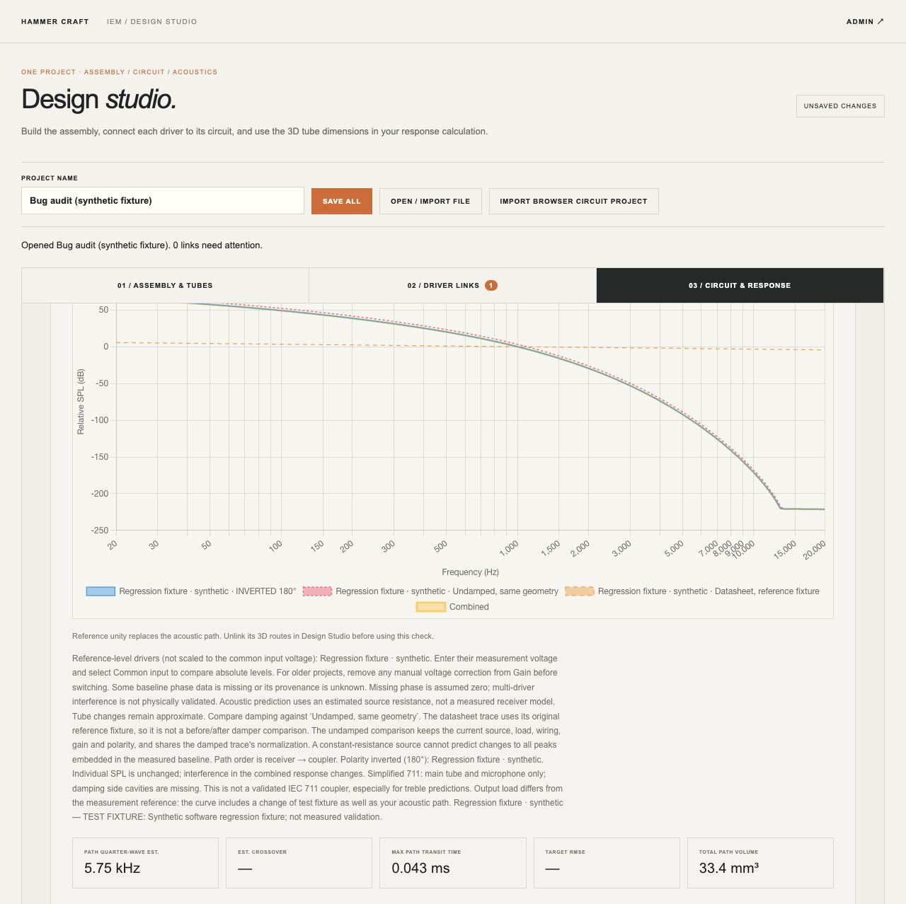

# Design Studio bug audit — 1 October 2026

Seven integration issues were found and fixed. The complete automated suite passes **163 tests**, with **0 failures and 0 skipped tests**. The baseline before this audit passed 149 tests; 14 regression cases were added. See [test output](tests.txt).

## Findings and fixes

| Issue | Reproduction / impact | Fix and verification |
| --- | --- | --- |
| Draft edits were not marked unsaved | Changing a 3D tube endpoint without Apply left the status at NEW PROJECT. Unblurred project names had the same gap. | Editor input now immediately marks the parent project dirty. Before-unload behavior is covered by tests; the browser shows UNSAVED CHANGES immediately. Saving and an unchanged queued rebuild leave the project clean. |
| A slow geometry build could overwrite a newer acoustic path | A deferred-build regression changed a tube from 10 to 25 mm while capture was waiting; the old implementation restored 10 mm. | Read acoustic state after geometry finishes. The regression retains 25 mm in the editor and saved project. |
| Changes arriving during an update could be dropped | A completion notification during a busy operation was ignored, leaving the shared snapshot out of date. | Queue reconciliation after the current operation. A deferred-operation test verifies the late editor change reaches the shared project. |
| Reference unity could replace a linked tube | The reference diagnostic replaced the entire acoustic path and output load, destroying the linked section's ID. | Refuse this destructive diagnostic while a route is linked, with an explanation to unlink first. Browser and regression tests verify length, binding and output load stay unchanged. Ordinary unlinked reference checks remain available. |
| Library copies retained another project's geometry bindings | Adding a saved driver could carry a stale-link error and locked tube fields into a different design. | Detach project-specific binding/error metadata when saving a reusable driver and when reusing older library entries. Dimensions and measurements are retained; the original design remains linked. |
| Invalid drafts blocked opening a saved project | Open / import first tried to build the current geometry, preventing recovery after invalid input. | Capture accepted geometry for rollback without applying the invalid draft. Browser recovery succeeded after zero shell scale and after an invalid draft name. Valid unblurred names and pending geometry edits are retained when importing only an acoustic component. |
| Some non-English names produced files the Rust engine rejected | The frontend allowed 200 characters while Rust limited names to 200 UTF-8 bytes. 67 Chinese characters passed the old frontend but failed the engine on reopen. | Match the Rust byte limit before saving, and validate a candidate before replacing accepted shared state. Tests check 66/67 Chinese-character boundaries against the real WASM engine. The browser blocks an invalid-name save and still permits opening a valid file. |

Cache versions were updated for the changed frontend scripts. No Rust equations or WASM binaries changed in this audit.

## Browser checks

An isolated test tab used the loopback preview and clearly labelled synthetic fixtures; the user's original workshop tab was left untouched.

- Fresh project: edited endpoint Y to 17 mm without Apply; the status immediately became UNSAVED CHANGES.
- Entered shell scale X = 0 and confirmed the existing validation error, then opened a valid shared project successfully.
- Entered a 67-character Chinese name and attempted Save all; the page reported the UTF-8 name limit instead of preparing an invalid file. Opening a valid file recovered successfully.
- Opened a linked reference fixture and pressed CHECK REFERENCE UNITY. The message explained the required unlink step; the linked tube remained **11.946959560794864 mm**, the second tube remained **3 mm**, and output load remained **anechoic**.
- In a fresh tab, edited endpoint Y to **17 mm** and renamed the project without pressing Apply. Importing only the acoustic component retained both edits. Linking afterwards displayed **17.74 mm / 1.60 mm bore** with no stale-link errors.
- Browser console checks reported no errors or warnings at the inspected checkpoints.

## Coverage and limits

The 163 tests include existing circuit, acoustic, measurement-data, STL, native tube parity, all 18 geometry-preset integration checks, and the new asynchronous coordination and data-preservation regressions. JavaScript syntax checks and `git diff --check` pass.

These results establish the tested software behavior, not a guarantee that the whole application is bug-free. Production authentication/deployment, manufacturing clearance, shell channel cutting and physical IEC 711 accuracy were not validated here. The acoustic fixture used for browser regression is synthetic and its plotted curve is not a receiver measurement.

See [workflow documentation](../../DESIGN_STUDIO.md).

