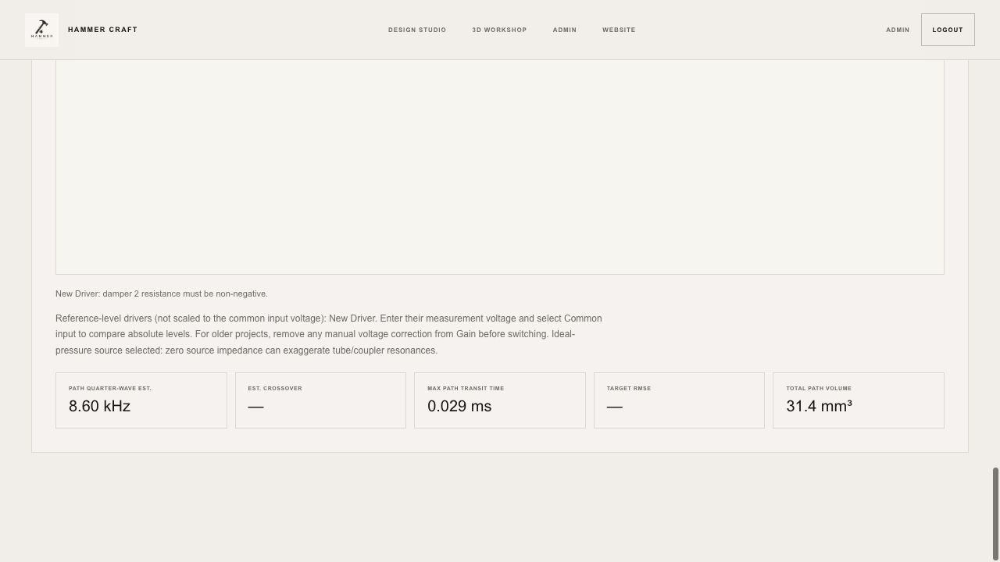

# Design-rule audit — 1 October 2026

The website enforces input, circuit-connectivity and project-link rules. **It does not yet enforce a complete set of manufacturing design rules.** Several native HeadphoneWorkshop packaging checks are absent from the web port. In particular, a successful geometry build or exported STL does not establish shell containment, printable wall thickness or collision clearance.

The confirmed input/enforcement bugs below are fixed. **176 automated tests pass, 0 fail, 0 are skipped**, including 13 new rule regressions. The previous suite contained 163 tests. See [complete test output](tests.txt) and [new regression cases](../../../tests/design-rules.test.mjs).

## Bugs fixed

| Finding | Previous behavior | Corrected behavior |
| --- | --- | --- |
| Empty numeric edits could become zero | Clearing damper resistance produced an undamped path. Clearing a resistor in its property dialog could create a short. Whitespace, booleans and arrays could also pass numeric coercion checks on imported data. | Preserve empty edits and reject non-numeric values before calculation. Explicit numeric zero still works for resistors, dampers and loss. Tests exercise both the editor handlers and the compiler. |
| Ambiguous circuit identities | Duplicate node/component IDs could merge unrelated nets or resolve a wire to the wrong owner. | Require unique, non-empty string IDs before compiling nets. An ambiguous graph produces diagnostics and no active compiled components. |
| Unknown acoustic sections and filters | Any unrecognised path type became a nozzle. Unsupported response filters could be silently omitted. Unsupported output loads were not diagnosed at the input boundary. | Reject unsupported types with input diagnostics. The path adapter also refuses unknown sections. Intentional legacy PEQ migration remains unchanged: PEQ belongs to target authoring. |
| Forward-model limits differed from accepted inputs | Bores below 0.1 mm passed validation although engine port/load calculations clamp to 0.1 mm. Filter Q below 0.05 was silently raised. Tiny reference-fixture bores could be marked complete. | Require bore ≥0.1 mm in forward paths and reference tube/chamber geometry; filter Q ≥0.05. These are model limits, not manufacturing recommendations. Boundary cases pass and generate finite test responses. |
| Reverse-search constraints could change silently | Length minima below 0.5 mm or bore minima below 0.3 mm were accepted and then raised by the optimiser. | Reject unsupported search bounds with the actual minimum in the message; HTML limits agree. Equal min/max values at the supported boundaries remain valid and are passed unchanged. |
| Malformed imported records threw incidental JavaScript exceptions | Null path/filter/circuit records failed during rendering or normalisation with property-access errors. | Reject malformed records during project preparation with a readable error. The working design remains unchanged. |
| Exact minimum tube wall could fail | Floating-point subtraction made some nominal 0.05 mm walls appear slightly too thin; a 4.0 mm bore with 4.1 mm OD reproduced this. | A 1e-12 mm arithmetic tolerance admits the exact boundary, including inlet taper radii. Walls 0.000001 mm thinner are still rejected. This tolerance is not a print tolerance. |

The geometry fix is compiled into the shipped **Rust/WASM engine 0.19.1**. Loader, worker and frontend cache versions were advanced. No acoustic equations were changed.

## What the rules actually enforce

“Blocks” means the relevant build/calculation/import is refused; it does not mean every invalid draft is forbidden from being saved for later editing.

| Area / rule | Current web behavior | Practical limit |
| --- | --- | --- |
| Geometry project identity and bounds | Blocks unsupported formats/versions, >12 packages, duplicate/reserved IDs, invalid coordinates, shell scales outside 0.25–4 and outlet leads outside 0.1–50 mm. | These are supported software ranges, not fit requirements. |
| STL parsing | Blocks malformed/truncated files, non-finite coordinates, invalid unit scale, >16 MB input and meshes outside the supported triangle/vertex limits. | STL units are supplied by the user; correct units cannot be inferred reliably. |
| Tube geometry | Blocks bore <0.1 mm, wall <0.05 mm, OD >20 mm, effectively zero-length paths and invalid tessellation. | A valid swept mesh may still self-intersect or collide with the assembly. The 0.05 mm annulus is a geometry limit, not a proven printable wall. |
| Shell edge topology | Reports open/nonmanifold edges, inconsistent winding and degenerate faces as warnings. | Export still preserves the mesh. No general self-intersection, shell-orientation or finished-part printability certification. |
| Package outside shell / overlapping packages | Coarse axis-aligned bounding-box warnings. | No exact inner-cavity containment or minimum separation; boxes can overestimate collisions and cannot establish usable cavity space. |
| Catalog integration notes | Warns about planning dimensions, dedicated electronics and rear-vent requirements. | No obstruction, back-volume, magnetic keepout or actual drive-electronics compatibility test. |
| Passive circuit | Blocks missing terminals, stale endpoints, unsupported parts, invalid active R/L/C values, input-to-ground shorts and a disconnected driver signal path. | A grounded driver output is a warning and valid zero-output diagnostic. Floating parts are warned about and excluded. No voltage/current/power/thermal-rating checks. |
| Acoustic inputs | Blocks invalid voltage, impedance, gain/sensitivity, supported source/load parameters, humidity, path dimensions/dampers and response filters. | Temperature has a numeric bound above absolute zero, not an experimentally validated operating range. Raw Rust APIs retain defensive clamps; the browser guards are not a comprehensive public-API validator. |
| Reference fixture | Database predictions require a supported measurement path/load and enabled compensation. | A supported approximate fixture is not proof of physical accuracy. Reference unity only checks arithmetic consistency. |
| Shared 3D/acoustic links | Stable IDs, accepted Rust-derived dimensions, read-only linked length/bore and stale-link errors; affected calculations are blocked. | The user still identifies matching geometry and acoustic drivers. Matching package names alone does not establish calibration. |
| Reverse design | Ordered supported bounds and non-negative candidate component values checked before search. | Its search remains an acoustic optimisation, not a manufacturing feasibility search. |
| Finished shell, ear fit and release | **Not implemented in the web port.** | Stock is not hollowed/machined; booleans, route cuts, connector cavities, finished shell wall thickness, ear fit and manufacturing release remain pending. |

Implementation inspected: [geometry engine](../../acoustic-engine/src/workshop.rs), [circuit compiler](../../cad-circuit.js), [acoustic input/request code](../../iem-designer.js), [shared project rules](../../design-project.mjs) and [transactional geometry worker](../../workshop-worker.js).

## Comparison with the native application

The supplied C++ source contains additional packaging rules. These values are **local project defaults, not universal material, printer or IEC requirements**:

| Native rule | Local default / implementation | Website status |
| --- | --- | --- |
| Shell wall construction | 1.30 mm shell-wall parameter | No finished shell construction/wall test |
| Installed wall clearance | 0.40 mm; inner-cavity ring containment logic for generated shells | Not ported to imported STL geometry |
| Rigid-part clearance | 0.18 mm base clearance; driver-pair rule can increase it for two unshielded magnets | Overlap warning only; no clearance gap |
| Acoustic route clearance | 0.12 mm plus tube radius, sampled against package bounds with outlet-attachment handling | No route/package clearance test |
| Surrogate inverse route constraints | Branch bore 0.56–1.84 mm, length 4–26 mm, tortuosity ≤1.60; shared-outlet area constraint | Not applied by the web reverse optimiser |

Sources: [native packaging constants and pair rules](/Users/bearcheung/Documents/HeadphoneWorkshop/src/app/ProductExperience.cpp:5615), [native generated-cavity containment](/Users/bearcheung/Documents/HeadphoneWorkshop/src/app/ProductExperience.cpp:19537), [native route clearance](/Users/bearcheung/Documents/HeadphoneWorkshop/src/app/ProductExperience.cpp:21526), [native inverse-path constraints](/Users/bearcheung/Documents/HeadphoneWorkshop/src/app/IemAcousticSurrogate.cpp:725).

The native ring-containment algorithm relies on its generated shell structure; it cannot simply be copied onto arbitrary imported STL meshes. The surrogate's branch ranges are constraints for that native search, not a reason to reject all other user-designed forward-model tubes.

## Every geometry preset checked

The full suite builds, places, rotates, mirrors and STL-round-trips every preset below. Its shared-project integration test also checks that each preset's computed route produces exactly the same acoustic result as manually entering those dimensions. That test uses a synthetic acoustic fixture; it does **not** validate the measured response of each physical receiver.

| Geometry preset | Mesh / placement / STL | Route-to-acoustic link | Catalog notes retained |
| --- | --- | --- | --- |
| 9 mm Dynamic Reference | PASS | PASS | Planning dimensions; Rear vent |
| 10 mm Dynamic Reference | PASS | PASS | Planning dimensions; Rear vent |
| Knowles RAB-32257 | PASS | PASS | Planning dimensions; Rear vent |
| Knowles WBFK-23990 | PASS | PASS | No additional catalog warning |
| Knowles TWFK-30017 | PASS | PASS | Planning dimensions |
| 14.2 mm Planar Reference | PASS | PASS | Planning dimensions; Rear vent |
| USound Adap UT-P2019 | PASS | PASS | Dedicated electronics; Rear vent |
| Knowles CI-22955 | PASS | PASS | Planning dimensions; Rear vent |
| Knowles RAU-34832 | PASS | PASS | Planning dimensions |
| Sonion 4100 | PASS | PASS | Planning dimensions; Rear vent |
| xMEMS Cowell | PASS | PASS | Dedicated electronics; Rear vent |
| xMEMS Muir | PASS | PASS | Dedicated electronics; Rear vent |
| Knowles RAD-33518 | PASS | PASS | Planning dimensions |
| Knowles RAF-32873-P183 | PASS | PASS | No additional catalog warning |
| Knowles ED-29689 | PASS | PASS | Planning dimensions |
| Knowles SR-32453-000 | PASS | PASS | No additional catalog warning |
| 5.0 mm Marketplace Planar Treble | PASS | PASS | Planning dimensions; Rear vent |
| 5.7 mm Marketplace Planar Treble | PASS | PASS | Planning dimensions; Rear vent |

The acoustic regression suite separately includes the ten recorded library fixtures, baseline/reference behavior, polarity, damping, voltage calibration, circuit solving and validation-export workflows. Geometry presets and measured acoustic records are different catalogs; neither count means new hardware measurements were taken.

## Verification

- `node --test tests/*.test.mjs`: **176/176 pass** against the rebuilt shipped WASM, including native C++ tube parity fixtures and all 18 geometry presets.
- Rust release build for `wasm32-unknown-unknown` and wasm-bindgen generation succeeded. `cargo test` succeeded but contains **0 native Rust tests**; behavioral coverage is supplied by the Node tests that execute WASM. The existing unused `propagation_constant` warning remains.
- Browser, isolated local preview: added a damper, cleared resistance and calculated. The page reports `CHECK INPUTS`, explains the invalid resistance and clears the previous plot. Connected the driver and entered explicit `0`: calculation completed on **engine 0.19.1**. Clearing it again blocked the next calculation.
- Browser, separate workshop preview: entered **4 mm bore / 4.1 mm OD**, clicked Apply and received `Geometry updated`; route length stayed **11.95 mm** and bore volume became **150.13 mm³**. The manufacturing-pending notice remains visible.
- The user's existing workshop and studio tabs were not changed. No physical measurements, printer/resin coupons, native manufacturing release, production authentication or deployment were validated in this audit.

## Next work for manufacturing design-rule checking

1. Model the finished shell and its intended cavities/channels, then implement containment, shell-wall and route/package clearance checks against that geometry. Preserve accepted-state rollback for rejected moves.
2. Add a named, versioned manufacturing profile with explicit material/process clearances and supplier-specific vent/magnetic/drive requirements. Use the native defaults only as a documented starting profile, validated against the intended process.
3. Give each rule an explicit pass / fail / not checked result and attach it to the exact saved design revision. Keep preview exports clearly labelled; a manufacturing release must require all mandatory checks to pass.
4. Validate with intentionally colliding/near-boundary CAD fixtures, manufactured dimensional coupons and measured receiver/coupler assemblies. Software regression passes and an edge-manifold mesh cannot substitute for those checks.
