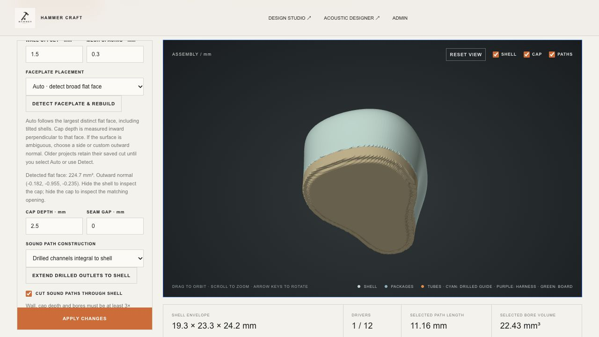
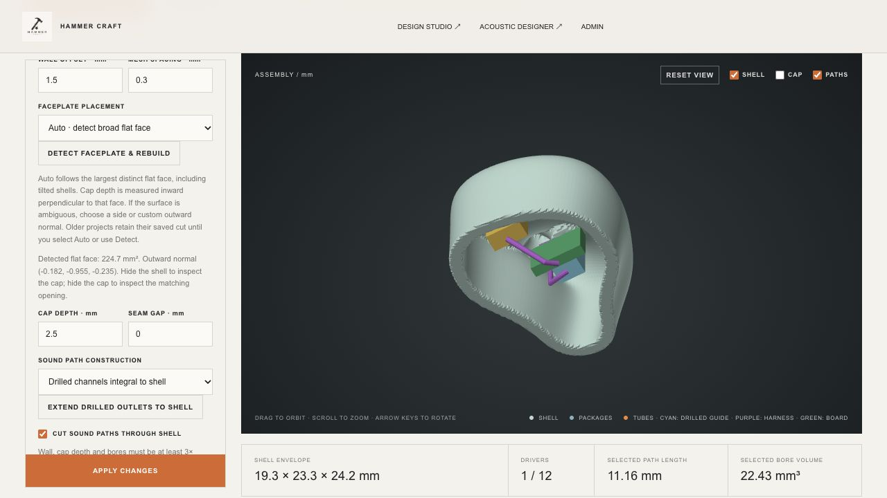

# Faceplate placement correction — 2026-10-01

Engine: Hammer Craft Acoustic Engine 0.24.0.

## Cause and correction

The previous cap used `maximum positive axis coordinate − depth`, defaulting to positive Z. The starter STL has an oblique broad face whose outward normal is approximately **(−0.182, −0.955, −0.235)**. A positive-Z slice therefore identified the wrong part of the shell as its cap.

The Rust engine now identifies connected, nearly coplanar patches by surface area. It selects a dominant exterior patch, ignoring parallel terraces when comparing competing orientations. It declines ambiguous or insufficiently planar meshes instead of silently choosing an axis. The starter's detected face is **224.715 mm²**, clearly larger than the nozzle end. Detection runs on the scaled stock; mirroring transforms both the geometry and the reported normal.

Cap depth is measured inward perpendicular to the selected face. Body construction, cap construction, package containment, equipment placement and cable routing share the same oriented plane. Cable clearance at that plane uses harness radius plus assembly clearance; shell wall thickness is applied separately against the stock surface.

Oblique cuts also exposed pinched marching-tetrahedra seams when the sampling lattice exactly coincided with an inner-wall crease. Oblique construction now phases the lattice within its padded domain, keeping grid spacing unchanged. Topology validation still rejects invalid generated solids.

## Usage and compatibility

- New construction defaults to **Auto · detect broad flat face**.
- For an older saved project, choose **Detect faceplate & rebuild**. Legacy projects retain their original cut until this is selected.
- Manual overrides support positive and negative X/Y/Z and a custom outward normal in the unmirrored layout coordinates.
- Hide **Cap** to see the matching opening; hide **Shell** to inspect internal placement.
- Moving the cap may expose existing collisions. Use **Auto arrange assembly**, or move the affected parts, before export. Failed detection/builds retain the previously accepted project and geometry.

## Verification

**276 Node/WASM tests and 7 Rust tests pass.** Commands:

```sh
node --test tests/*.test.mjs
cargo test --manifest-path docs/acoustic-engine/Cargo.toml
```

New regressions cover the native face versus its nozzle, rotation/translation, anisotropic scaling, mirroring, all six axis sides, custom diagonal cuts, cap collisions, ambiguity and invalid normals, cable routing, worker rollback, save/reopen and STL triangle preservation. Existing tests across all 18 package presets continue to pass. The Rust regression covers the diagonal-cut topology defect directly.

The previous drilled-channel example was rebuilt with automatic cap detection. The former board and one harness intersected the corrected cap; auto-arrange repositioned the board and rerouted the harnesses successfully. Final browser and engine results:

- 0 placement errors, 0 warnings and 0 export blockers.
- Body: 205,116 triangles; cap: 84,756 triangles.
- Both solids: 0 boundary edges, nonmanifold edges, winding conflicts or degenerate triangles.
- One integral drilled channel and two harness routes retained.
- Seven existing items still require interface/process verification; geometry checks are not manufacturing qualification.

[Reproducible parameters and checks](example-parameters.json) use the existing `docs/assets/workshop/solid-shell.stl` source, imported at scale 1 and centred by the engine.





## Limits

Automatic identification is a geometric heuristic for a dominant broad, flat external face, not recognition of every possible custom shell. Curved or ambiguous cap surfaces need manual selection. The cap and shell remain sampled meshes; grid spacing controls surface approximation. Exact retention features, manufacturing tolerances and finished-part fit still need validation.
