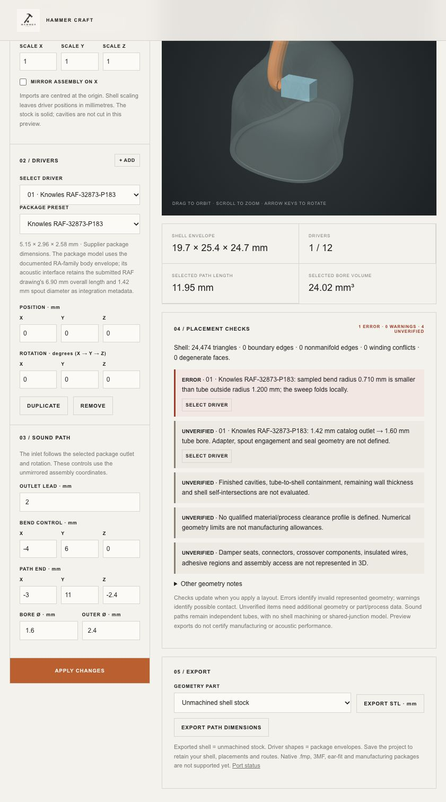

# IEM placement checks implemented — 1 October 2026

The website now checks the represented driver packages and sound routes after each accepted geometry update. The inspection panel separates **errors**, **warnings** and **unverified requirements**, identifies affected drivers and provides a Select Driver action. Layouts with placement errors remain editable and saveable; confirmed errors prevent affected linked acoustic routes from being calculated as valid geometry.

This is the first implementation of the [placement review](../2026-10-01-iem-placement/report.md). It is a check of software geometry, not verification of a manufactured IEM. No new receiver measurements or manufacturing qualification were performed.

## Implemented behavior

| Check | Behavior / scope |
| --- | --- |
| Driver outside stock bounds | Error if the represented package extends outside the stock's bounding box. Being inside that box does not establish cavity fit. |
| Driver-to-driver overlap | Separating-axis tests on transformed convex box / faceted-cylinder envelopes. Positive overlap is an error; touching is a warning because an allowed contact interface is not defined. Rotated bounding-box overlap alone no longer produces a collision warning. |
| Tube-to-driver penetration | Exact curve-subdivision endpoints and rendered outer-ring vertices inside a convex package produce an error. Remaining possible contacts are checked using bounded curve segments and tube outside radius and produce warnings. Includes the route's own driver. |
| Own outlet departure | The outlet connection is allowed without a blanket early-route time exemption. A route returning into its own package is diagnosed. This does not validate spout/adapter geometry. |
| Tube-to-tube contact | Conservative curved-route envelopes are compared. Possible overlap produces a warning, including coincident outlets, since there is no physical shared-junction model. |
| Local tube fold / reversal | Sampled curvature smaller than the outside radius produces an error. Interior stationary points with reversing tangents are also diagnosed. A clear result does not establish the material's minimum bend radius. |
| Nonlocal self-contact | Distant sections of a returning route are compared with conservative envelopes. Possible self-contact produces a warning. Adjacent portions are excluded and local bends checked separately. |
| Shell topology / orientation | Existing edge/topology counts now produce structured errors. Closed shells with non-positive total signed volume produce an orientation error. Individual disconnected solids and self-intersections still need more checks. |
| Missing part/process information | Provisional dimensions, undefined outlet adapters/seals, required rear vents/back volumes, dedicated electronics and missing assembly geometry are explicitly unverified. No universal manufactured-part spacing is invented. |
| Mirroring | Distance/intersection checks are invariant under the whole-assembly reflection. A separate unverified item records that purchased-part handedness and both-side access have not been checked. |

Checks operate on existing package envelopes. They do not include protrusions absent from those envelopes. Catalog dimension flags are provenance metadata, not fresh supplier certification. Warnings identify possible contact; they must not be interpreted as exact contact-depth measurements.

Curves are recursively subdivided towards a 0.01 mm control-hull-to-chord bound, up to depth 10 (at most 1,024 segments). Each segment retains its actual bound; conservative contact envelopes include that bound. Reaching the limit adds an unverified diagnostic. Local curvature uses 257 samples and analytic stationary-point candidates. These limits, the adjacent-section exclusion and the own-outlet treatment mean this is not an exhaustive exact swept-solid self-intersection proof.

## A further problem found and fixed

The previous RAF starter used a 2 mm outlet lead and bend control `[-4, 6, 0]` mm. Its sampled minimum centreline bend radius was approximately **0.710 mm**, below the tube's **1.200 mm outside radius**. The sweep folded locally.

The starter now uses a **3 mm lead** and bend control **`[-7, 5, 0]` mm**, retaining its endpoint and bore. The new checks report zero errors and zero warnings for that starter, with five explicit unverified requirements. The old route remains a regression fixture that must produce the bend error.

## Integration and persistence

- Every build returns structured checks with stable rule codes, status, affected part IDs and a message. Per-route confirmed placement errors accompany its computed dimensions.
- Design Studio refuses to synchronise affected routes as valid acoustic inputs. Existing stale-link handling blocks calculation; fixing geometry clears the error on the next synchronisation.
- The editable design is retained so errors can be repaired. Numeric/malformed-input failures still preserve the previous accepted geometry transactionally.
- The Select Driver action applies pending edits through the existing transactional workflow before changing selection.
- Project reopen rebuilds checks from geometry. Exported path-dimension JSON includes checks. STL exports remain explicitly labelled geometry previews, not approved manufacturing files.
- Worker, engine, editor and Design Studio cache versions were advanced together. Refresh an already-open page to load the new code.

Implementation: [Rust placement module](../../acoustic-engine/src/workshop/placement.rs), [workshop integration](../../acoustic-engine/src/workshop.rs), [inspection interface](../../headphone-workshop.js), [shared-route validation](../../design-project.mjs).

## Verification

**204 / 204 Node regression tests pass**, with zero skipped, including **28 new placement tests**. **2 / 2 native Rust geometry tests pass.** The existing unused `propagation_constant` warning remains. [Node results](tests.txt) · [Rust results](rust-tests.txt) · [Placement tests](../../../tests/placement-checks.test.mjs).

The new coverage includes:

- All 18 catalog presets with straight outward routes, compound rotation and mirroring. Clear routes generate no errors/contact warnings; relevant missing-data diagnostics remain present.
- The previously reproduced route through an unrelated RAF package. It now produces a `tube-package` error; moving the obstruction clear removes the route errors.
- Return into the route's own receiver, rotated package overlap, exact package contact, and cylindrical corner cases that an axis-aligned box would falsely flag.
- Contact involving tube outside radius even when its centreline misses the package; crossing tubes and separation in Z; local folded bends, interior reversals and nonlocal returning-route contact.
- Globally inverted/open shells and packages beyond stock bounds.
- A linked acoustic calculation that is blocked by a confirmed placement error and unblocked after repair.

The all-preset acoustic-link test now uses an outward route aligned to each preset's own outlet axis. The old shared RAF bend was invalid for several other outlet orientations. Acoustic equivalence is still checked against manually entered dimensions; this remains a synthetic test, not measured receiver validation.

The updated [gap diagnostic output](probes.json) includes structured checks. The original through-package probe still has 319 of 1,001 centreline points inside the unrelated package and is now explicitly diagnosed. The original broad-outlet probe also reveals its pre-existing return/fold geometry; its separate adapter requirement remains unverified. Inward shell orientation now has a specific error. Unrelated acoustic-model gaps from that diagnostic remain outside this implementation.

In a separate local browser tab, I reproduced the old starter bend and observed **1 error**, then repaired it through Select Driver. The panel returned to **0 errors, 0 warnings, 5 unverified**, preserving the edited values. The user's existing tabs were not edited. A 12-driver overlapping/rotated cylinder stress case returned 340 diagnostics in approximately 1.27 seconds locally; this is an observation, not a cross-device performance guarantee.

Verified browser engine: **0.20.0**. WASM SHA-256: `3c4f0f12d710418d31b65787c2b7ddb3aa8ad8f08446099333d367c894a23322`.

## Remaining work

Finished cavities, tube-to-shell containment, remaining wall thickness, actual vent geometry/cavity connectivity, physical adapters/damper seats, connector/wire/crossover packing, assembly access and a qualified manufacturing process profile are still missing. They are displayed as unverified. Shared acoustic junctions and physical response validation are also still outstanding. No manufacturing-ready or acoustically validated status is granted by this checker.
