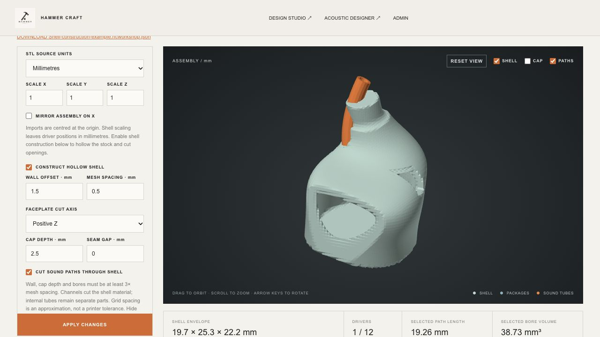

# IEM shell-construction milestone

Date: 2026-10-01. Browser engine: 0.21.0.

## Delivered

The Rust website can now turn closed STL stock into a sampled hollow body and a separate faceplate. Enable **Construct hollow shell** in the 3D workshop. The settings also travel with the geometry section of a Design Studio project.

- Requested wall offset and grid spacing.
- Faceplate cut on positive X, Y or Z, configurable cap depth and seam gap. Cap depth is measured from the stock bounding face; it is not a uniform faceplate thickness.
- Sound-bore cuts following the existing cubic routes through shell material.
- One rectangular or cylindrical connector opening with position, size and rotation.
- Separate body/faceplate visibility and STL exports. Constructed shells render as opaque surfaces for cavity inspection; hide the shell to view internal parts.
- Sampled package-to-cavity checks for every package preset. Detected penetration propagates to the existing linked-acoustic error handling.
- Save/open retains the original stock and editable parameters, rather than repeatedly machining an already hollowed mesh. Invalid construction edits retain the last accepted geometry.
- A scrollable desktop control panel keeps Apply available while editing the longer construction form.

## Verification

| Check | Result |
| --- | --- |
| Full Node/WASM regression suite | **214 passed, 0 failed**; [log](node-tests.txt) |
| Native Rust tests | **5 passed, 0 failed**; [log](rust-tests.txt) |
| New construction suite | 10 tests, including all 18 package presets in a known cavity and at a penetrating position |
| Native C++ implicit-surface fixture | Matching triangle count and oriented triangle coordinates within 1e-10 mm on an analytic hollow sphere |
| Analytic cube body / cap | Closed, consistently oriented solids; volumes within 5% / 3% of analytic values |
| Bore and box/cylinder cuts | Remove measured solid volume while retaining closed topology |
| Mirroring, cut axis and seam gap | Tested on actual generated geometry |
| Binary STL export / reimport | Body and cap remain closed and preserve volume within 1e-5 relative error |
| Grid refinement on native starter | Combined material volume at 0.5 and 0.4 mm spacing differs by less than 3% |
| Rejected input | Open/inward stock, unresolved features, malformed settings and oversized grids reject clearly |
| Browser | Built hollow shell and rectangular opening, toggled cap, changed placement/outlet and rejected an invalid wall; no captured console errors |
| Downloaded project | Browser-created JSON read from disk and rebuilt successfully; shared-project round trip preserves its construction settings |

Tests exercise software geometry. They do not establish physical acoustic accuracy, ear fit or process qualification. All 18 presets receive the same construction/cavity-check path; that does not imply that all 18 fit the starter shell or have measured acoustic calibration.

## Defects found during implementation

The initial surface generator could emit distinct vertices arbitrarily close to a grid point. Binary STL rounds coordinates to float32, causing some triangles to collapse on reimport. Exact grid-point crossings now share a vertex. Generated positions are canonicalized at STL precision, identical stored positions are welded, and collapsed-index faces are removed before topology validation. Construction rejects remaining boundary edges, nonmanifold edges, winding conflicts, degenerate faces or non-positive signed volume. No arbitrary spatial welding tolerance is used.

The original 100,000-triangle budget also prevented finer construction of the supplied starter. It is now 300,000 triangles per mesh, with a separate construction budget of 650,000 grid points and 128 cells per axis. Oversized requests reject instead of silently reducing resolution.

The starter's default package at [0, 0, 0] has approximately **-0.21 mm** minimum sampled cavity clearance at a 1.5 mm requested wall. Its original path endpoint is also not fully outside the stock. Both conditions are now visible; existing user layouts are not automatically moved.

## Reproducible browser example

Open [example.hcworkshop.json](example.hcworkshop.json) with **Open project**. This is the file saved by the tested browser UI. It uses the native starter stock, a RAF package at [3, -2, 0] mm, path endpoint [-3, 15, -2.4] mm, 1.5 mm wall, 0.5 mm grid, positive-Z cap depth 2.5 mm and a rotated rectangular opening.

The rebuilt example has **90,832 body triangles**, **9,992 faceplate triangles**, and zero reported boundary/nonmanifold/winding/degenerate defects. Requested cavity volume is approximately **2,218 mm³**. Minimum sampled package clearance is **0.61 mm**. It reports zero represented placement errors and warnings, with eight requirements explicitly unverified. Exact metrics and check messages are saved in [example-metrics.json](example-metrics.json).

This is an editing and geometry demonstration, not a manufacture-ready design. The visible standalone tube is not constrained to remain entirely inside the shell.

## Remaining migration work

| Next area | Still required |
| --- | --- |
| Shell completion | Integral tube-wall unions, native nozzle details, faceplate retention/sealing, connector-specific seats and exact remaining-wall/clearance checks |
| Acoustic components in 3D | Stepped routes, positioned dampers and chambers, shared manifolds, spout adapters and seals |
| Electronics | Physical crossover parts, connector bodies, insulated wire routes and assembly access |
| Ear-fit | Ear-profile import, surface fitting and fit constraints |
| Stereo | Linked but independently editable left/right assemblies |
| Native persistence | `.fmp` migration and compatibility fixtures |
| Manufacturing | 3MF, BOM, assembly packages and release reports |
| Other native features | Other product families and surrogate AI remain unported |

The numerical model samples a mesh distance field and 64 straight segments along each sound route. Features must be at least three grid spacings across; the grid is not a manufacturing tolerance. Package clearance samples vertices and centre, so positive values do not prove complete containment in a concave cavity. Self-intersections, exact thin-wall minima, detached material, feature continuity and fit after fabrication are not fully certified. The native fixture validates the surface generator only, not equivalence of the full native finished-shell workflow.

Current feature coverage and build instructions: [HeadphoneWorkshop port status](../../HEADPHONE_WORKSHOP_PORT.md).
