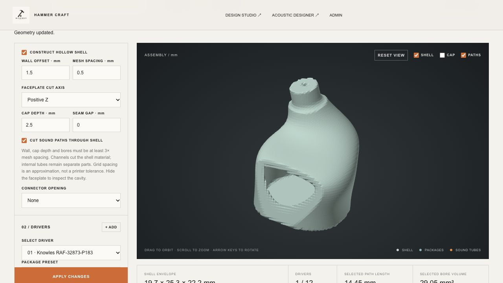

# Shell containment and export enforcement

Date: 2026-10-01. Browser engine: 0.22.0.

The workshop now requires every represented driver package and physical sound tube to pass containment before allowing an STL export. The previous bounding-box test allowed parts outside the curved shell, and no shell test existed for tubes. Constructed-mode package checks previously sampled only vertices and centre.

## Implemented behavior

- Check the complete represented triangle surface against the actual closed stock envelope, including tube outer walls and bends.
- For constructed shells, additionally keep driver packages inside the requested wall offset and below the faceplate cut plane.
- Test triangle clearance, not just corners. A face spanning a concavity now fails even when every corner and the package centre are inside.
- Check float32 vertex coordinates, matching WebGL and binary STL. Numeric rounding cannot silently change a nominally contained preview into a protruding export.
- Require a closed, outward-wound shell with one connected surface. Unsupported or broken shells produce unverified containment and block export.
- Highlight parts with errors in red and show specific repair messages. All STL exports are blocked while placement errors or unverified containment remain. The worker independently enforces this rule, beyond disabling the button.
- Preserve project saving and editing for invalid layouts. Restoring valid positions/routes immediately restores export. Affected acoustic links are also blocked until repaired.
- Correct the new-project starter position and bend so its package and tube pass both stock-mode and constructed-mode containment. Existing user files are diagnosed without silently moving, shrinking or cropping their parts.

Machining cut volumes are tools, not physical components. They may remove shell material; they do not give the physical tube an exemption to protrude. The outlet message now asks for a tube endpoint inside the intended outlet instead of instructing the user to extend a physical tube beyond the stock.

## Evidence

**241 Node/WASM tests and 5 native Rust tests passed.** See [Node log](node-tests.txt) and [Rust log](rust-tests.txt).

The 27 new containment tests cover all 18 presets in valid and outside placements, tube outer-wall protrusion with a contained centreline, curved excursions between contained endpoints, a narrow concavity bridged by driver faces, faceplate clearance, scaling/mirroring, open/disconnected stock, float32 rounding and worker export blocking/recovery. The former protruding construction example is now explicitly tested as invalid; the corrected starter is tested with construction on and off.

Older circuit-link and component-collision fixtures used routes outside the native shell while claiming those layouts were clear. Those isolated tests now use a roomy analytic envelope, preserving their original assertions about circuit data and component contact. Separate native-starter regressions verify the actual IEM shell.

Browser verification:

1. New starter: no placement errors; STL export enabled.
2. Extend tube endpoint Y from 11 to 18 mm: tube containment error, red tube, STL disabled, Save Project enabled.
3. Restore Y to 11 mm: errors clear and STL export re-enables.
4. Enable hollow construction: driver cavity and tube envelope checks pass; STL remains enabled.
5. No captured browser console errors.

[Full browser capture of blocked export](export-blocked.png)

## Corrected example and boundaries

Open [contained-example.hcworkshop.json](contained-example.hcworkshop.json) in the workshop. It updates the earlier example's tube bend and endpoint while retaining its source stock and rectangular connector cut. [Saved check results](example-checks.json) show no export blockers. The former report/example is preserved as historical evidence, not silently replaced.

The checks establish containment of the represented part meshes relative to the imported shell envelope, assuming that envelope is a valid non-self-intersecting solid. A numerical separation of 0.00001 mm handles boundary ambiguity; this is not a manufacturing allowance. Self-intersecting stock is not fully validated. Generated shell surfaces remain a sampled approximation to the requested stock/offset.

Tube-to-shell material interference and sealing, a continuous finished outlet, post-cut wall thickness, printer tolerances, ear fit and acoustic measurement accuracy remain separate checks. Wires, connector bodies and physical dampers are not yet represented and therefore cannot be certified by this check. Invalid designs remain visible for repair; the rule blocks their STL export rather than silently modifying their geometry.
