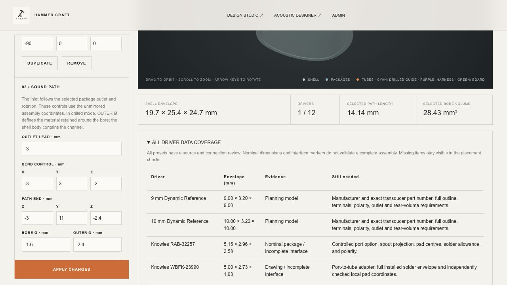

# All-driver physical-data review

2 October 2026 · Acoustic Engine 0.28.0 · 19 geometric presets

The hardware library now has a separate evidence, connection and mounting record for **every preset**. This completes catalog coverage; it does **not** mean every preset has a fully dimensioned manufacturing model. The interface gaps below remain visible in the website and Rust placement checks.

## Implemented changes

- Added per-driver package/outlet evidence, documented electrical labels, mounting requirements, source links and specific missing-data lists. The new **All driver data coverage** table is available below the 3D viewer without enabling electronics planning.
- Rust reads driver display pieces from the hardware catalog instead of hard-coding only Sonion 2356. Sonion's existing display and full envelope are preserved. Adap, Cowell and Muir now show simplified, enclosed interface markers. Dark markers represent openings, not drilled solids or manufacturing bores; Adap displays its dimensioned central slot and back vent only.
- All 19 harness approaches come from explicit records. MEMS approaches the rear contact face; RAF retains its documented family side approach; Sonion retains its rear terminal strip approach. Other anchors are explicitly provisional. A grouped approach reserves conductor space and never claims to be an individual solder pad.
- Corrected TWFK-30017-000 to **vented** and CI-22955-000 to **unvented**, following the [Knowles selection guide](https://www.knowles.com/docs/default-source/default-document-library/ba-selection-guide-pro-audio-v031223.pdf).
- Corrected the Muir front-opening count to **11**, in 4/3/4 rows, from Figure 5.1 of the [XSC-2200 revision 1.0 drawing](https://cdn.shopify.com/s/files/1/0563/7151/1348/files/XMEMS_DATASHEET_XSC-2200_v1.0.pdf?v=1729709840). Eleven 0.55 mm openings give a 1.824144 mm equivalent-area diameter. The existing tube location is retained as a planning adapter centre. Cowell has 15 front openings and two rear vents; Muir has six rear vents.
- Added distinct Cowell T2/B1 and Muir T3/B2 pin labels and identified the mechanical SM lands. The carrier PCB, its vent opening, solder seal and compatible biased piezo amplifier remain required, unmodeled hardware. [Cowell drawing](https://cdn.shopify.com/s/files/1/0563/7151/1348/files/XMEMS_DATASHEET_XSC-2150_v1.3.pdf?v=1729709821), [Muir drawing](https://cdn.shopify.com/s/files/1/0563/7151/1348/files/XMEMS_DATASHEET_XSC-2200_v1.0.pdf?v=1729709840).
- Recorded Adap BE/TE contacts, dedicated drive and permitted support zones. Its 1.40 mm central slot width is no longer presented as proof of a circular port. [Adap datasheet](https://www.usound.com/wp-content/uploads/2020/01/2001_Adap-UT-P-2019-Datasheet.pdf).
- Removed complete-interface confidence from WBFK, RAF and the three MEMS presets where the current modeled port is only a partial representation or surrogate. Manufacturer body dimensions alone cannot validate the full installed interface.

Existing driver IDs, poses, circuit connections and polarity choices remain unchanged. Muir's outlet-diameter metadata and vent/confidence checks update when rebuilding an existing project. No acoustic transfer functions were recalibrated by this change. The surface-seated socket function remains generic across all driver presets.

## Driver-by-driver coverage

Envelope dimensions are the geometry currently reserved by the system. For can-only entries they do not include an unmodeled spout, solder joint or carrier. Generic reference drivers are not substituted with unrelated commercially available parts.

| Driver | Envelope mm | Evidence/status | Still needed | Reference |
|---|---|---|---|---|
| 9 mm Dynamic Reference | 9 × 3.2 × 9 | Planning model | Manufacturer and exact transducer part number, full outline, terminals, polarity, outlet and rear-volume requirements. | [Source](https://www.64audio.com/products/nio) |
| 10 mm Dynamic Reference | 10 × 3.2 × 10 | Planning model | Manufacturer and exact transducer part number, full outline, terminals, polarity, outlet and rear-volume requirements. | [Source](https://moondroplab.com/en-products/jiu) |
| Knowles RAB-32257 | 5.15 × 2.96 × 2.58 | Nominal package / incomplete interface | Controlled port option, spout projection, pad centres, solder allowance and polarity. | [Source](https://www.knowles.com/docs/default-source/default-document-library/rab-datasheet.pdf?Status=Master&sfvrsn=9e1a77b1_0) |
| Knowles WBFK-23990 | 5 × 2.73 × 1.93 | Drawing / incomplete interface | Port-to-tube adapter, full installed solder envelope and independently checked local pad coordinates. | [Source](https://www.knowles.com/docs/default-source/model-downloads/wbfk-23990-000.pdf?Status=Master&sfvrsn=2b2475b1_0) |
| Knowles TWFK-30017 | 5 × 2.73 × 3.86 | Dual package / incomplete interface | Ordered terminal map, vent location, full port shape and solder envelope. | [Source](https://www.knowles.com/docs/default-source/default-document-library/tw-datasheet.pdf?Status=Master&sfvrsn=521a77b1_0) |
| 14.2 mm Planar Reference | 14.2 × 1.5 × 14.2 | Planning model | Manufacturer and exact transducer part number, full outline, terminals, polarity, outlet and rear-volume requirements. | [Source](https://blog.64audio.com/solo-planar-magnetic-in-ear-monitors/) |
| USound Adap UT-P2019 | 6.7 × 4.7 × 1.58 | Drawing / carrier required | Host carrier, front/rear seal, individual solder joints, amplifier placement and electrical netlist. | [Source](https://www.usound.com/wp-content/uploads/2020/01/2001_Adap-UT-P-2019-Datasheet.pdf) |
| Knowles CI-22955 | 9.47 × 7.18 × 4.1 | Nominal package / incomplete interface | Controlled port coordinates, complete terminal outline and polarity. | [Source](https://www.knowles.com/docs/default-source/default-document-library/receiver-datasheet-ci-22955-000-1efdd1a731dff6ddbb37cff0000940c19.pdf?Status=Master&sfvrsn=0) |
| Knowles RAU-34832 | 5.1 × 2.8 × 2 | Nominal package / incomplete interface | Controlled port coordinates, pad map and full installed envelope. | [Source](https://www.knowles.com/docs/default-source/model-downloads/receiver-datasheet-rau-34832-b148.pdf?Status=Master&sfvrsn=713c73b1_4) |
| Sonion 4100 | 5 × 2.7 × 0.98 | Family dimensions / variant missing | Exact 4100 variant and its controlled outlet, terminal, vent and polarity drawing. | [Source](https://datasheet.datasheetarchive.com/originals/crawler/america.sonion.com/22fbf1adb725928d7344843240d16269.pdf) |
| xMEMS Cowell | 6 × 3.2 × 1.15 | Drawing / carrier required | Host carrier, front/rear seal, individual solder joints, amplifier placement and electrical netlist. | [Source](https://cdn.shopify.com/s/files/1/0563/7151/1348/files/XMEMS_DATASHEET_XSC-2150_v1.3.pdf?v=1729709821) |
| xMEMS Muir | 5 × 3.2 × 1.15 | Drawing / carrier required | Host carrier, front/rear seal, individual solder joints, amplifier placement and electrical netlist. | [Source](https://cdn.shopify.com/s/files/1/0563/7151/1348/files/XMEMS_DATASHEET_XSC-2200_v1.0.pdf?v=1729709840) |
| Knowles RAD-33518 | 5 × 2.73 × 1.93 | Exact outline unavailable | Exact ordered-part outline, outlet, pad coordinates, polarity and mounting details are missing. | [Source](https://www.knowles.com/applications/ear-solutions/premium-sound) |
| Knowles RAF-32873-P183 | 5.15 × 2.96 × 2.58 | Family terminal side / variant incomplete | Controlled P183 outline including spout, exact side-pad centres and installed solder allowance. | [Source](https://investor.knowles.com/news/news-details/2017/Knowles-Launches-New-RAF-Series-Balanced-Armature-Drivers-Delivering-Premium-Sound-in-a-New-Design-01-03-2017/default.aspx) |
| Knowles ED-29689 | 6.32 × 4.31 × 2.97 | Drawing located / interface pending | Transfer of controlled outline, terminal positions, polarity and port geometry. | [Source](https://www.knowles.com/docs/default-source/model-downloads/ed-29689-000.pdf?Status=Master&sfvrsn=216775b1_1) |
| Knowles SR-32453-000 | 6.4 × 3.99 × 6.4 | Cylindrical package / incomplete terminals | Exact pad centres, installed solder allowance, carrier and broad outlet adapter. | [Source](https://www.knowles.com/docs/default-source/default-document-library/datasheet-sr.pdf?Status=Master&sfvrsn=741a77b1_0) |
| 5.0 mm Marketplace Planar Treble | 5 × 2.8 × 1.8 | Planning model | Manufacturer and exact transducer part number, full outline, terminals, polarity, outlet and rear-volume requirements. | [Source](https://www.alibaba.com/trade/search?SearchText=5mm+planar+treble+speaker) |
| 5.7 mm Marketplace Planar Treble | 5.7 × 3 × 1.9 | Planning model | Manufacturer and exact transducer part number, full outline, terminals, polarity, outlet and rear-volume requirements. | [Source](https://www.alibaba.com/trade/search?SearchText=5.7mm+planar+treble+speaker) |
| Sonion 2356 | 8.54 × 4.29 × 2.96 | Drawing / terminal region | Individual pad centres, solder volume, vent clearance, boot and engagement/seal geometry. | [Source](https://datasheet.datasheetarchive.com/originals/crawler/sonion.com/0c95de506dd88ba6e190dee502fc81fb.pdf) |

## Evidence limits

The USound and xMEMS PDFs were downloaded and their mechanical/interface pages visually inspected. Knowles WBFK polarity and model specifications were available as manufacturer document text; several Knowles outline PDFs could not be downloaded for fresh visual transcription. Their existing nominal envelopes are retained with the remaining interface work identified. An exact ED-29689-000 drawing was located and linked, but a new controlled CAD outline was not transcribed. Sonion 4100 dimensions were confirmed as a family specification in the archived manufacturer application note, pages 2 and 7. Sonion 2356 and RAF side-terminal evidence from the preceding review are retained.

The 9 mm/10 mm dynamic and 14.2 mm planar references identify diameter classes in finished earphones. The 5.0 mm/5.7 mm marketplace presets lack an identifiable manufacturer part number. RAD-33518 still lacks a usable controlled outline. Exact pad coordinates are deliberately absent from these records; terminal labels are not fabricated coordinates.

**Remaining physical work:** controlled port/spout and solder envelopes for can-only BA presets, individual terminal/pad coordinates, model-specific support/retention, MEMS carriers and seals, tolerances, adapter engagement, back-volume geometry and an electrical netlist. Auto arrange fits represented geometry; it cannot certify missing hardware. Manufacturer CAD/drawings or measured parts are needed to close these entries.

## Verification

**343/343 Node/WASM tests and 7/7 native Rust tests pass.** The 22 new tests cover catalog completeness, all 19 presets under rigid rotation and reflection, display/interface-marker containment within their reserved envelope, save/reopen, missing-evidence checks, source-specific vent and MEMS role regressions, and automatic harness routing to all 19 group anchors. Existing tests also cover STL, curved-shell containment, construction, connector surface seating, nozzle alignment and circuit/acoustic workflows.

All-driver routing tests use a roomy closed cube to isolate interface correctness; they do not imply all 19 drivers fit every real ear shell. The browser check selected all 19 presets, confirmed every evidence/connection/missing-data panel, checked all 19 table rows, and rendered Muir in the native starter shell. That example reports zero represented-geometry errors/warnings and ten unverified items. No warning/error console messages were recorded.

- [Regression output](regression-tests.txt)
- [Native Rust output](native-tests.txt)
- [Browser checks](browser-checks.json)
- [Per-driver machine-readable records](driver-data-status.json)
- [Verification and artifact hashes](verification.json)
- Test source: [driver-hardware.test.mjs](../../../tests/driver-hardware.test.mjs)

Reproduce with `node --test tests/*.test.mjs` after rebuilding the shipped WASM, and `cargo test --manifest-path docs/acoustic-engine/Cargo.toml` with the configured Rust toolchain. The browser preview uses the existing loopback-only test fixture; production authentication is unchanged.

