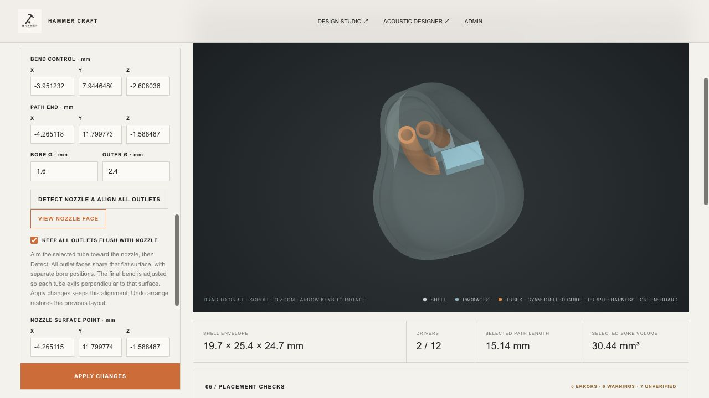

# Flush tube outlets — 2 October 2026

Tube outlets can now share the nozzle's flat end surface. Each bore keeps its separate position; alignment projects the endpoints onto one plane and turns each final tangent perpendicular to it. Both inner and outer terminal rims are coplanar. This does not join the bores into one acoustic junction.

## Use

In **Headphone Workshop → 03 / Sound path**, aim the selected tube's end toward the nozzle and click **DETECT NOZZLE & ALIGN ALL OUTLETS**. Detection follows that tube's final direction from its bend point to the first shell surface. Inspect that it found the intended nozzle face; click **VIEW NOZZLE FACE** to look straight at the outlets.

**KEEP ALL OUTLETS FLUSH WITH NOZZLE** is enabled after alignment. Apply changes reprojects the endpoints and restores their perpendicular exit directions. Auto arrange preserves the same plane and tangent. The shared plane, exit lead and outlet positions save with the project; **UNDO ARRANGE** restores the prior layout after detection. Manual surface-point, normal and exit-lead controls are available beneath the checkbox.

Detection can try several exit tangent leads to find a contained route without a locally folded tube. Manual lead edits are used exactly as entered and are rejected if they make the route invalid. The receiver inlet, driver dimensions and circuit connections are preserved. Accepted path lengths and bore volumes are recalculated for export and existing Design Studio links.

Separate tubes terminate at the face. In drilled mode, the bores terminate at the same plane and are cut into the shell body. Existing sampled-solid resolution limits still apply to the machined shell.

## Bounds and limits

- This feature requires a **flat nozzle surface** and a closed, outward-wound shell. A tangent plane on a curved wall is rejected when the outlet footprint does not lie on it.
- Only the verified terminal annuli may touch the shell. The remainder of each tube still passes full mesh containment checks; setting a nozzle plane does not allow protruding tubes or packages.
- Outlet circles must fit on the face and remain separate. The command preserves lateral positions and does not pack overlapping outlets automatically. When adding/repositioning routes, temporarily disable the lock if needed, place separate outlets, then detect again.
- Coordinates are unmirrored assembly millimetres. Mirroring reflects the entire result. Replacing/scaling the shell can invalidate the saved plane; detect the actual surface again.
- Failed alignment retains the previous accepted worker project. Other existing placement checks and export blocks remain in force.

## Verification

**307 Node/WASM tests and 7 native Rust tests passed** with Acoustic Engine 0.26.0. Seven new geometry tests cover three distinct outlets, every vertex of the terminal annuli, binary STL coordinates, tilted/translated and mirrored shells, native nozzle detection, auto arrange, malformed/stale planes, overlapping/out-of-face outlets, drilled shell topology, edit reprojection and transactional save/reopen. The existing circuit, acoustic and containment regressions also passed.

Browser verification used the native shell with two receivers: detect/align, face-on view, undo and reapply all passed; placement showed zero errors and zero warnings, with existing unverified manufacturing/interface items retained. No browser warning/error messages were recorded. This used the local fixture preview.

- [Openable two-outlet workshop example](two-flush-outlets.hcworkshop.json)
- [Compact example parameters](example-parameters.json)
- [Engine hash and measured geometric residuals](verification.json)
- [Regression output](regression-tests.txt) and [native test output](native-tests.txt)

Open the example with **OPEN PROJECT** in Headphone Workshop, or **OPEN / IMPORT FILE** in Design Studio. It is an editable geometry example; it does not replace the user's current project automatically.
