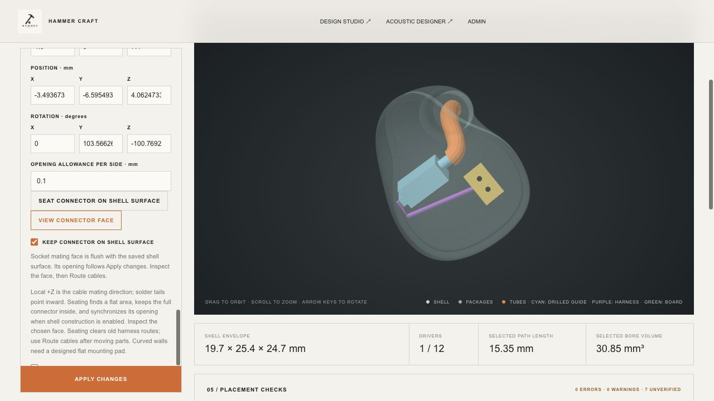

# Surface-mounted connectors and physical parts

2 October 2026 · Acoustic Engine 0.27.0

The connector's mating face now sits on a verified flat shell surface, with its body and solder tails inside. **Auto arrange assembly** seats an enabled, unlocked connector before packing drivers and the board. An existing mounting surface stays fixed during arrangement. **Seat connector on shell surface** performs seating independently; **View connector face** looks straight at it. Undo restores the previous project.

## Use

1. Enable **Electronics & cabling → Include assembly planning** and the pin connector.
2. Choose the actual catalog model, or enter the complete dimensions under **Custom envelope**. The connector's local +Z is its mating direction; negative Z points towards the internal solder tails.
3. Click **Seat connector on shell surface**, or **Auto arrange assembly**. Inspect the chosen flat area. The saved surface lock preserves it through Apply changes and save/reopen.
4. With **Construct hollow shell** enabled, the rectangular mounting pocket follows the socket pose and per-side allowance. The socket rear must reach the cavity. The pocket reserves the complete envelope; manufacturer-specific retention, adhesive, interference fits and pull-out strength remain separate design work.
5. Route cables after moving parts. Seating clears outdated harness reservations. Circuit nets and polarity stay in the acoustic/circuit designer.

A flat rectangular mating face cannot be made coplanar with a curved wall. The system rejects unsuitable footprints and retains the accepted project; it does not push corners outside the shell. A curved-side mounting location needs a designed flat pad or a different shell. The search includes the dominant broad flat patch so dense STL tessellation cannot hide it behind thousands of curved facets.

## Manufacturer data added

| Part | Represented size in mm | Shape / connection information | Source |
|---|---|---|---|
| AEC IJ-001G-POM | 4.90 × 3.00 × 7.40 overall | Stepped insulator, two contact openings and two solder tails; 1.80 contact pitch. Nominal outline; simplified corner rounds and spring internals. | [AEC drawing, revision B](https://cdn.prod.website-files.com/58b76f3a4d7bd33133263ab3/68a563e8c97c68e7195e78be_IJ-001G-POM%20DRAWING%20_%2020250820.pdf) |
| AEC MX-1004GT-SA0025 | 3.51 × 4.50 × 7.50 overall | Conservative envelope for this specific MMCX edgecard socket. Central contact and outer conductor are distinct; exact ground-tab lands remain drawing work. | [AEC drawing](https://cdn.prod.website-files.com/58b76f3a4d7bd33133263ab3/5bb584a81db3678d2c14de44_MX-1004.pdf) |
| Sonion 2356 | Case 6.30 × 4.29 × 2.96; reserved overall length 8.54 | Case, projecting spout and rear terminal strip rendered separately within a complete enclosing volume. Rear vent must stay open. | [Archived Sonion manufacturer datasheet, v2, 2008](https://datasheet.datasheetarchive.com/originals/crawler/sonion.com/0c95de506dd88ba6e190dee502fc81fb.pdf) |
| Knowles RAF family | Existing package dimensions retained | Harness approach moved from the generic rear to a side face. Exact P183 pad centres/numbering remain unverified. | [Knowles terminal-location announcement](https://investor.knowles.com/news/news-details/2017/Knowles-Launches-New-RAF-Series-Balanced-Armature-Drivers-Delivering-Premium-Sound-in-a-New-Design-01-03-2017/default.aspx) |

The AEC two-pin drawing's contact-bore diameter does not establish compatibility with every cable sold as “0.78 mm.” Select the ordered socket/plug combination, rather than treating the catalog model as universal. Both connector options are available because the user's exact connector part number was not specified.

[Hardware catalog](../../assets/workshop/hardware.json) stores source links, revisions, dimensions, terminal-region confidence and guidance. [Driver catalog](../../assets/workshop/drivers.json) now contains 19 geometric presets. The other 18 retain their previous geometry and dimensional-confidence labels; this update is not a fresh verification of all their supplier drawings. The new interface text explicitly identifies missing terminal coordinates instead of presenting a generic anchor as a measured solder pad.

## How connections are represented

The physical structure is **cable socket → crossover board, when enabled → driver terminal regions**. A harness reserves space for an insulated conductor pair. It is not a pin-level netlist, nor a model of solder joints. The RAF side-face approach is a family-based estimate. Sonion uses the rear strip location; its individual pad centres are not fabricated. Other receivers still use a clearly marked provisional anchor. MEMS and multi-element receivers still need their dedicated model pinouts and drive circuits.

The in-app **Part drawings & connection guide** links [Knowles AN-13](https://www.knowles.com/docs/default-source/default-document-library/an-13-issue02.pdf?sfvrsn=4) for heat sinking, soldering and wire guidance. Wire gauge and insulated harness diameter remain separate inputs. Board dimensions, individual resistors/capacitors, damper seats and adhesive are not converted into verified parts by this update; exact BOM models are still needed for those.

Display meshes show simplified hardware features. Collision and STL checks reserve the full conservative envelope, including pins and spouts. The tiny dark socket recess indicators are display aids, not measured contact internals. Supplier tolerance and mounting allowance must be added to nominal part dimensions as appropriate.

## Verification and examples

**321 Node/WASM tests and 7 native Rust tests passed.** [Regression output](regression-tests.txt) and [native output](native-tests.txt) are included. Regression results and engine hash are recorded in [verification.json](verification.json). Coverage includes both socket presets, flush face and complete body containment, hollow-shell opening alignment, solder-tail cavity access, tilted/mirrored geometry, rejection of stale models/planes/cuts, transactional edits, save/reopen, automatic seating, RAF side routing, all 19 driver presets, and simultaneous native-shell nozzle/socket alignment.

- [Surface-mounted example](surface-mounted-example.hcworkshop.json): native shell stock, Sonion 2356, AEC two-pin socket, flush nozzle outlet and routed harness. Stock layout containment passes; it is not a hollow manufacturing shell.
- [Hollow-shell example](hollow-shell-example.hcworkshop.json): same hardware, rearranged inside a requested 0.9 mm wall with 0.3 mm mesh spacing and 2.5 mm cap depth. The original 1.5 mm wall did not admit the tested automatic layout. This is a geometric example, not a qualified wall/process specification; inspect the sampled pocket and remaining material before manufacturing.

Both examples preserve separate electrical/acoustic configuration. Open them with **Open project**; they do not replace an existing user project automatically. Full driver electroacoustic calibration, pin-level wiring validation and manufacturing qualification are outside these geometry tests.

